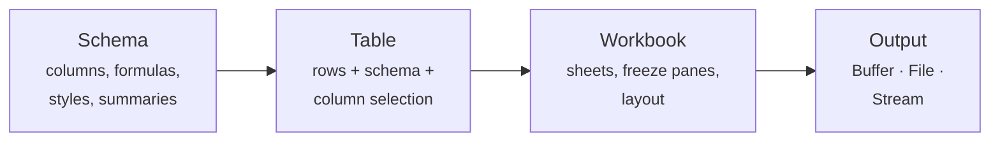

`xlsmith` is a schema-driven XLSX builder for TypeScript. Define your report once as a typed schema — columns, formulas, styles, summaries — then pass rows to it. Get a spreadsheet back.

Everything is statically typed end-to-end: column accessors, formula references, schema context, and summary reducers. If your schema doesn't match your row type, TypeScript tells you before you run anything.



## A real schema in 30 lines

```ts twoslash
import { createExcelSchema, createWorkbook } from "xlsmith";

type Invoice = {
  id: string;
  customer: string;
  qty: number;
  unitPrice: number;
  taxRate: number;
  status: "paid" | "pending" | "overdue";
};

const schema = createExcelSchema<Invoice>()
  .column("id", { header: "Invoice #", accessor: "id", width: 14 })
  .column("customer", { header: "Customer", accessor: "customer", minWidth: 20 })
  .column("qty", { header: "Qty", accessor: "qty", width: 8 })
  .column("unitPrice", {
    header: "Unit Price",
    accessor: "unitPrice",
    style: { numFmt: "$#,##0.00" },
  })
  // Formula column — Excel evaluates this live; references are type-checked
  .column("subtotal", {
    header: "Subtotal",
    formula: ({ row, refs, fx }) => fx.round(refs.column("qty").mul(refs.column("unitPrice")), 2),
    style: { numFmt: "$#,##0.00" },
    summary: (s) => [s.formula("sum")], // SUM footer row
  })
  .column("taxRate", { header: "Tax %", accessor: "taxRate", style: { numFmt: "0%" } })
  .column("total", {
    header: "Total",
    formula: ({ row, refs, fx }) =>
      fx.round(refs.column("subtotal").mul(refs.column("taxRate").add(1)), 2),
    style: { numFmt: "$#,##0.00" },
    summary: (s) => [s.formula("sum")],
  })
  .column("status", {
    header: "Status",
    accessor: "status",
    // Per-row conditional style — full type inference on `row`
    style: ({ row }) => ({
      font: {
        color: {
          rgb: row.status === "paid" ? "166534" : row.status === "overdue" ? "B42318" : "92400E",
        },
      },
    }),
  })
  .build();

const workbook = createWorkbook();
workbook
  .sheet("Invoices", { freezePane: { rows: 1 } })
  .table("invoices", { rows: [], schema, title: "Invoice Report — Q1 2025" });

await workbook.writeToFile("./invoices.xlsx");
```

The schema is a plain, stateless object. Pass it to as many tables as you need — different rows, different column selections, different summaries.

## Why type-safety matters here

Most Excel libraries give you a row/cell API: `ws['A1'] = { v: row.name }`. Nothing stops you from writing `row.nmae`. There is no autocomplete on column IDs. There is no type error when a formula references a column that doesn't exist yet.

`xlsmith` builds the type state into the schema chain:

- **Accessors** — `"user.address.city"` dot-paths and `(row) => row.value` callbacks are fully typed against your row type `T`.
- **Formula references** — `refs.column("subtotal")` is a compile error if `subtotal` hasn't been declared before this column. The predecessor constraint is enforced by the TypeScript type system at definition time.
- **Schema context** — `createExcelSchema<Row, Context>()` declares a schema-wide runtime `context` object available to dynamic builders, formulas, styles, transforms, formats, hyperlinks, and other typed callbacks. Missing or wrong-typed context is a compile error.
- **Column selection** — `select.include` and `select.exclude` accept a union of your declared column IDs. No typos get through.

## What the library includes

| Feature                   | Notes                                                                                                        |
| ------------------------- | ------------------------------------------------------------------------------------------------------------ |
| Type-safe schema builder  | Column accessors, formulas, styles, summaries all typed against `T`                                          |
| Formula DSL               | `refs.column`, `row.series`, `fx.round/if/abs/min/max`, arithmetic, conditionals — emits live Excel formulas |
| Excel table mode          | Native `<table>` with autoFilter, styled banded rows, totals row, structured refs                            |
| Dynamic columns           | Generate columns from runtime data; schema context shape statically inferred                                 |
| Reducer-based summaries   | `init / step / finalize` accumulators, works in both buffered and streaming builds                           |
| Multi-table sheet layouts | Multiple tables per sheet, configurable column/row gaps                                                      |
| Sub-row expansion         | Array-valued accessors expand into multiple rows with cell merges                                            |
| Streaming builder         | `createWorkbookStream()` — batch-commit API, bounded memory, supports all features                           |
| Custom OOXML + ZIP engine | No SheetJS, no third-party spreadsheet library in the call stack                                             |
| Multiple output targets   | `Buffer`, file, Node readable/writable, Web `ReadableStream` / `WritableStream`                              |

## Acknowledgment

The custom OOXML serializer and ZIP-based spreadsheet engine in `xlsmith` were heavily inspired by [hucre](https://github.com/productdevbook/hucre) and the work of [productdevbook](https://github.com/productdevbook). That project showed me it was possible to build a custom OOXML serializer and zip it into a valid Excel file, which became the foundation for this library's spreadsheet engine.

## Two builders, same schemas

```ts twoslash
import { createWorkbook, createWorkbookStream } from "xlsmith";

declare const rows: Array<Record<string, unknown>>;
declare const schema: import("xlsmith").SchemaDefinition<Record<string, unknown>>;
declare const cursor: AsyncIterable<Array<Record<string, unknown>>>;
// Buffered — synchronous composition, full dataset in memory
const wb = createWorkbook();
wb.sheet("Report").table("report", { rows, schema });
const buffer = wb.toBuffer();

// Streaming — async commit-based, bounded memory
const stream = createWorkbookStream();
const table = await stream.sheet("Report").table("report", { schema });
for await (const batch of cursor) {
  await table.commit({ rows: batch });
}
await stream.writeToFile("./report.xlsx");
```

Both builders accept the same schema definitions. The only difference is the call pattern.

## When to use `xlsmith`

| Scenario                                                    | Recommendation                                |
| ----------------------------------------------------------- | --------------------------------------------- |
| Regular reports from TypeScript data models                 | `xlsmith` — typed schemas, summaries, styling |
| Native Excel tables with autoFilter and totals              | `xlsmith` with `mode: "excel-table"`          |
| Streaming exports of 100k+ rows                             | `xlsmith` with `createWorkbookStream()`       |
| Reusing one schema across multiple export views             | `xlsmith` — schemas carry no state            |
| Fully dynamic workbooks where shape is unknown at code time | Lower-level library                           |

## Next steps

- Install the package — [Installation](/getting-started/installation)
- Build your first report — [Quick Start](/getting-started/quick-start)
- See how `xlsmith` compares to SheetJS and ExcelJS — [Library Comparison](/getting-started/comparison)
- Understand the two schema modes — [Schema Modes](/core-concepts/schema-modes)
