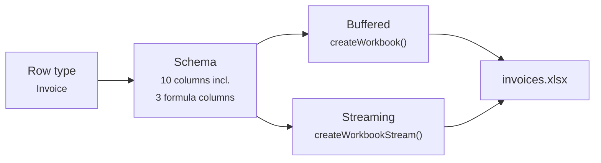

This guide walks you through a complete invoice report with formula columns, a summary row, and conditional styling. Once the schema is built you'll see how the same definition works for both buffered and streaming output.



## Install

```bash
npm install xlsmith
```

## Define your row type

```ts twoslash
type Invoice = {
  invoiceId: string;
  customer: string;
  issueDate: string;
  qty: number;
  unitPrice: number;
  taxRate: number;
  status: "paid" | "pending" | "overdue";
};
```

## Build the schema

```ts twoslash
type Invoice = {
  invoiceId: string;
  customer: string;
  issueDate: string;
  qty: number;
  unitPrice: number;
  taxRate: number;
  status: "paid" | "pending" | "overdue";
};
// ---cut---
import { createExcelSchema } from "xlsmith";

const invoiceSchema = createExcelSchema<Invoice>()
  .column("invoiceId", { header: "Invoice #", accessor: "invoiceId", width: 14 })
  .column("customer", { header: "Customer", accessor: "customer", minWidth: 20 })
  .column("issueDate", { header: "Issue Date", accessor: "issueDate", width: 14 })
  .column("qty", { header: "Qty", accessor: "qty", width: 8 })
  .column("unitPrice", {
    header: "Unit Price",
    accessor: "unitPrice",
    width: 14,
    style: { numFmt: "$#,##0.00" },
  })
  // Formula column: Qty * Unit Price, rounded to 2 dp
  .column("subtotal", {
    header: "Subtotal",
    formula: ({ row, refs, fx }) => fx.round(refs.column("qty").mul(refs.column("unitPrice")), 2),
    width: 14,
    style: { numFmt: "$#,##0.00" },
    summary: (s) => [s.formula("sum")],
  })
  .column("taxRate", {
    header: "Tax %",
    accessor: "taxRate",
    width: 10,
    style: { numFmt: "0.0%" },
  })
  .column("taxAmount", {
    header: "Tax",
    formula: ({ row, refs, fx }) =>
      fx.round(refs.column("subtotal").mul(refs.column("taxRate")), 2),
    width: 12,
    style: { numFmt: "$#,##0.00" },
    summary: (s) => [s.formula("sum")],
  })
  .column("total", {
    header: "Total",
    formula: ({ row, refs }) => refs.column("subtotal").add(refs.column("taxAmount")),
    width: 14,
    style: { numFmt: "$#,##0.00" },
    summary: (s) => [s.formula("sum")],
  })
  .column("status", {
    header: "Status",
    accessor: "status",
    width: 12,
    style: ({ row }) => ({
      font: {
        bold: row.status === "overdue",
        color: {
          rgb: row.status === "paid" ? "166534" : row.status === "overdue" ? "B42318" : "92400E",
        },
      },
    }),
  })
  .build();
```

The schema is a plain, stateless object. It works identically in buffered and streaming mode.

## Buffered output

Best for small-to-medium datasets (up to ~50 k rows) where you already have all rows in memory:

```ts twoslash
type Invoice = {
  invoiceId: string;
  customer: string;
  issueDate: string;
  qty: number;
  unitPrice: number;
  taxRate: number;
  status: "paid" | "pending" | "overdue";
};
import { createExcelSchema } from "xlsmith";
const invoiceSchema = createExcelSchema<Invoice>()
  .column("invoiceId", { accessor: "invoiceId" })
  .column("customer", { accessor: "customer" })
  .column("issueDate", { accessor: "issueDate" })
  .column("qty", { accessor: "qty" })
  .column("unitPrice", { accessor: "unitPrice" })
  .column("subtotal", {
    formula: ({ row, refs, fx }) => fx.round(refs.column("qty").mul(refs.column("unitPrice")), 2),
  })
  .column("taxRate", { accessor: "taxRate" })
  .column("taxAmount", {
    formula: ({ row, refs, fx }) =>
      fx.round(refs.column("subtotal").mul(refs.column("taxRate")), 2),
  })
  .column("total", {
    formula: ({ row, refs }) => refs.column("subtotal").add(refs.column("taxAmount")),
  })
  .column("status", { accessor: "status" })
  .build();
// ---cut---
import { createWorkbook } from "xlsmith";

const rows: Invoice[] = [
  {
    invoiceId: "INV-001",
    customer: "Acme Corp",
    issueDate: "2025-01-15",
    qty: 10,
    unitPrice: 299,
    taxRate: 0.2,
    status: "paid",
  },
  {
    invoiceId: "INV-002",
    customer: "Globex Inc",
    issueDate: "2025-01-22",
    qty: 5,
    unitPrice: 850,
    taxRate: 0.2,
    status: "pending",
  },
  {
    invoiceId: "INV-003",
    customer: "Initech",
    issueDate: "2025-02-03",
    qty: 2,
    unitPrice: 1200,
    taxRate: 0.2,
    status: "overdue",
  },
];

const workbook = createWorkbook();
workbook.sheet("Invoices", { freezePane: { rows: 1 } }).table("invoices", {
  schema: invoiceSchema,
  rows,
  title: "Invoice Report — Q1 2025",
});

await workbook.writeToFile("./invoices.xlsx");

// Or get a Buffer for HTTP responses, S3 uploads, etc.
const buffer = workbook.toBuffer();
```

## Streaming output

For large datasets (100 k+ rows), database cursors, or paginated APIs. The schema is unchanged — only the builder call pattern differs:

```ts twoslash
type Invoice = {
  invoiceId: string;
  customer: string;
  issueDate: string;
  qty: number;
  unitPrice: number;
  taxRate: number;
  status: "paid" | "pending" | "overdue";
};
import { createExcelSchema } from "xlsmith";
const invoiceSchema = createExcelSchema<Invoice>()
  .column("invoiceId", { accessor: "invoiceId" })
  .column("customer", { accessor: "customer" })
  .column("issueDate", { accessor: "issueDate" })
  .column("qty", { accessor: "qty" })
  .column("unitPrice", { accessor: "unitPrice" })
  .column("subtotal", {
    formula: ({ row, refs, fx }) => fx.round(refs.column("qty").mul(refs.column("unitPrice")), 2),
  })
  .column("taxRate", { accessor: "taxRate" })
  .column("taxAmount", {
    formula: ({ row, refs, fx }) =>
      fx.round(refs.column("subtotal").mul(refs.column("taxRate")), 2),
  })
  .column("total", {
    formula: ({ row, refs }) => refs.column("subtotal").add(refs.column("taxAmount")),
  })
  .column("status", { accessor: "status" })
  .build();
// ---cut---
import { createWorkbookStream } from "xlsmith";

const workbook = createWorkbookStream();

const table = await workbook
  .sheet("Invoices", { freezePane: { rows: 1 } })
  .table("invoices", { schema: invoiceSchema });

// Replace with your database cursor or paginated API
async function* fetchPages(): AsyncGenerator<Invoice[]> {
  yield [
    {
      invoiceId: "INV-001",
      customer: "Acme Corp",
      issueDate: "2025-01-15",
      qty: 10,
      unitPrice: 299,
      taxRate: 0.2,
      status: "paid",
    },
    {
      invoiceId: "INV-002",
      customer: "Globex Inc",
      issueDate: "2025-01-22",
      qty: 5,
      unitPrice: 850,
      taxRate: 0.2,
      status: "pending",
    },
  ];
}

for await (const page of fetchPages()) {
  await table.commit({ rows: page });
  // Memory freed after each commit — heap stays flat
}

await workbook.writeToFile("./invoices.xlsx");
```

Streaming supports all buffered features: formula columns, excel-table mode, groups, summaries, sub-row expansion, and freeze panes. See [Streaming Intro](/streaming/streaming-intro) for output targets and memory tuning.

## What the exported file includes

- Formula columns that Excel evaluates live (`=ROUND(D2*E2,2)`, etc.)
- A summary row with `SUM` formulas for subtotal, tax, and total
- Conditional text colour on the status column (green / amber / red)
- A frozen header row for scroll stability

## Next steps

- Explore the full schema API — [Defining Columns](/columns/defining-columns)
- Write formula columns with conditionals — [Formula Columns](/formulas/formula-columns)
- Emit native Excel tables — [Table Mode](/excel-tables/table-mode)
- Compare with SheetJS and ExcelJS — [Library Comparison](/getting-started/comparison)
