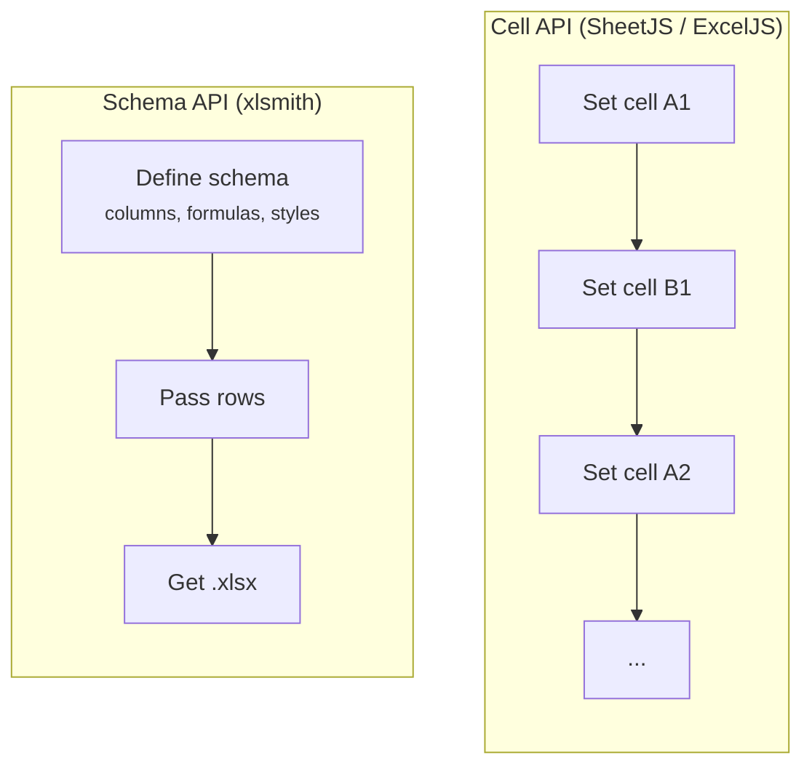

SheetJS, ExcelJS, and xlsmith all produce valid `.xlsx` files. The difference is in the programming model: SheetJS and ExcelJS give you a cell-level API and leave report structure to you. xlsmith gives you a schema-driven builder where columns, formulas, styles, and summaries are declared once and type-checked at compile time.

## Feature matrix

| Feature                      |         SheetJS         |       ExcelJS        |                  xlsmith                   |
| ---------------------------- | :---------------------: | :------------------: | :----------------------------------------: |
| **Programming model**        |      Cell mutation      |   Row/cell builder   |               Schema-driven                |
| **TypeScript row safety**    |        :x: None         |    :x: `any` rows    |       :white_check_mark: End-to-end        |
| **Typed accessors**          |           :x:           |         :x:          |             :white_check_mark:             |
| **Formula DSL**              |   :x: String formulas   | :x: String formulas  |    :white_check_mark: Type-checked refs    |
| **Schema reusability**       |           :x:           |         :x:          |    :white_check_mark: Stateless objects    |
| **Dynamic columns**          |           :x:           |         :x:          | :white_check_mark: Inferred schema context |
| **Column summaries**         |    :warning: Manual     |   :warning: Manual   |    :white_check_mark: Built-in reducers    |
| **Native Excel tables**      |    :warning: Raw XML    |         :x:          |       :white_check_mark: First-class       |
| **Sub-row expansion**        |    :warning: Manual     |   :warning: Manual   |        :white_check_mark: Automatic        |
| **Streaming writes**         |    :warning: Limited    |  :warning: Limited   |       :white_check_mark: Full parity       |
| **Memory model (streaming)** |    :x: Full dataset     |   :x: Full dataset   |    :white_check_mark: Bounded by batch     |
| **Output targets**           |      Buffer, file       | Buffer, file, stream |      Buffer, file, Node & Web stream       |
| **Charts**                   |           :x:           |  :white_check_mark:  |                    :x:                     |
| **Image embedding**          |           :x:           |  :white_check_mark:  |                    :x:                     |
| **Rich text per cell**       |    :warning: Partial    |  :white_check_mark:  |                    :x:                     |
| **Comments / notes**         |   :white_check_mark:    |  :white_check_mark:  |                    :x:                     |
| **Dependencies**             |    0 (pro) / bundled    |       Several        |                     0                      |
| **License**                  | Apache 2.0 / Commercial |         MIT          |                    MIT                     |

:white_check_mark: Supported&ensp; :warning: Partial / manual&ensp; :x: Not supported

---

## The core difference: cell API vs schema API



SheetJS and ExcelJS are **cell APIs**. You write individual cells and rows:

```ts
// SheetJS — you manage cell addresses and format strings manually
import * as XLSX from "xlsx";

const ws: XLSX.WorkSheet = {};
ws["A1"] = { v: "Invoice #", t: "s" };
ws["B1"] = { v: "Total", t: "s" };
ws["A2"] = { v: "INV-001", t: "s" };
ws["B2"] = { v: 2990, t: "n", z: "$#,##0.00" };

const wb = XLSX.utils.book_new();
XLSX.utils.book_append_sheet(wb, ws, "Invoices");
XLSX.writeFile(wb, "invoices.xlsx");
```

```ts
// ExcelJS — row-by-row, cells by index
import ExcelJS from "exceljs";

const wb = new ExcelJS.Workbook();
const ws = wb.addWorksheet("Invoices");
ws.columns = [
  { header: "Invoice #", key: "id", width: 14 },
  { header: "Total", key: "total", width: 14 },
];
ws.addRow({ id: "INV-001", total: 2990 });
await wb.xlsx.writeFile("invoices.xlsx");
```

```ts
// xlsmith — declare the schema once, pass rows
import { createExcelSchema, createWorkbook } from "xlsmith";

type Invoice = { id: string; total: number };

const schema = createExcelSchema<Invoice>()
  .column("id", { header: "Invoice #", accessor: "id", width: 14 })
  .column("total", {
    header: "Total",
    accessor: "total",
    width: 14,
    style: { numFmt: "$#,##0.00" },
  })
  .build();

const workbook = createWorkbook();
workbook.sheet("Invoices").table("invoices", { rows: [], schema });
await workbook.writeToFile("invoices.xlsx");
```

The schema is a separate, stateless object. It isn't bound to a workbook, sheet, or any runtime state. You can pass it to ten different tables in ten different workbooks without any issue.

---

## Type safety

This is where the gap is largest.

### SheetJS

SheetJS has essentially no TypeScript safety on the data path. Cell addresses are strings. Cell values are `any`. If your column moves from `B` to `C` you update every reference by hand.

### ExcelJS

ExcelJS ships TypeScript definitions, but they don't carry your row type. The `addRow()` call accepts `any`. Nothing prevents `ws.addRow({ id: row.nmae })` — the typo compiles cleanly.

### xlsmith

The schema is parameterized by your row type `T`. Every accessor is verified:

```ts
type Order = { orderId: string; amount: number; region: string };

const schema = createExcelSchema<Order>()
  // "orderId" is checked against keyof Order — "orederId" would be a compile error
  .column("id", { accessor: "orderId" })
  // Callback has full type inference on `row`
  .column("region", { accessor: (row) => row.region.toUpperCase() })
  .build();
```

Formula references go further — referencing a column that doesn't exist yet is a TypeScript error at the definition site, before you run the build:

```ts
const schema = createExcelSchema<{ qty: number; price: number }>()
  .column("qty", { accessor: "qty" })
  .column("price", { accessor: "price" })
  .column("total", {
    // refs.column("qty") and refs.column("price") are type-checked
    // refs.column("discount") would be a compile error here — "discount" isn't declared yet
    formula: ({ row, refs, fx }) => fx.round(refs.column("qty").mul(refs.column("price")), 2),
  })
  .build();
```

---

## Formula columns

Neither SheetJS nor ExcelJS has a formula DSL. To write `=ROUND(C2*D2,2)` into a cell, you construct the string yourself and manage row numbers manually. When rows shift, your formulas break silently.

xlsmith emits formula strings for you from a composable DSL. You reference columns by their declared ID, not by their physical address:

```ts
.column("subtotal", {
  formula: ({ row, refs, fx }) => fx.round(refs.column("qty").mul(refs.column("unitPrice")), 2),
})
.column("tax", {
  formula: ({ row, refs, fx }) => fx.round(refs.column("subtotal").mul(0.2), 2),
})
.column("total", {
  formula: ({ row, refs }) => refs.column("subtotal").add(refs.column("tax")),
})
```

In report mode the library emits `=ROUND(C2*D2,2)`, `=ROUND(E2*0.2,2)`, `=E2+F2` with the correct addresses. In excel-table mode it emits structured references: `=ROUND([@Qty]*[@UnitPrice],2)`.

If you add a column between `qty` and `unitPrice`, all downstream formulas shift automatically. There is nothing to update manually.

---

## Schema reusability and column selection

A common requirement: one canonical schema, but different exports show different columns depending on the audience — internal team sees cost data, external report hides it.

With SheetJS or ExcelJS you maintain two worksheet-building functions, or write conditional logic that manually skips cells and adjusts column indices.

With xlsmith the schema accepts a `select` option at table-build time:

```ts
// Full schema defined once
const schema = createExcelSchema<SalesRow>()
  .column("region", { accessor: "region" })
  .column("revenue", { accessor: "revenue" })
  .column("cost", { accessor: "cost" }) // internal only
  .column("margin", { accessor: "margin" }) // internal only
  .build();

// External export — cost and margin excluded
workbook.sheet("External").table("sales", {
  rows,
  schema,
  select: { exclude: ["cost", "margin"] },
});

// Internal export — full schema
workbook.sheet("Internal").table("sales", { rows, schema });
```

The `select` union is typed — `"cost"` and `"margin"` are checked against the schema's declared column IDs.

---

## Dynamic columns

Some reports require columns that are only known at runtime — one column per organization, one per month, one per category. xlsmith supports this with `.dynamic()`:

```ts
const schema = createExcelSchema<UserRow, { orgs: Org[] }>()
  .column("name", { accessor: "name" })
  .dynamic("orgs", (builder, { ctx }) => {
    for (const org of ctx.orgs) {
      builder.column(`org-${org.id}`, {
        header: org.name,
        accessor: (row) => (row.memberOf.includes(org.id) ? "✓" : ""),
      });
    }
  })
  .build();

// Context shape is inferred — `{ orgs: Org[] }` is required, wrong type is a compile error
workbook.sheet("Users").table("users", {
  rows,
  schema,
  context: { orgs: fetchedOrgs },
});
```

There is no equivalent in SheetJS or ExcelJS. Both require you to write the column-generation loop yourself and manually manage column indices.

---

## Native Excel tables

An Excel `<table>` object is not just styling — it enables autoFilter, column totals via `SUBTOTAL()`, structured formula references, and correct sorting behavior in Excel desktop. Creating a real native table with SheetJS requires writing raw XML into the worksheet. ExcelJS has no support for it.

xlsmith treats native Excel tables as a first-class schema mode:

```ts
const schema = createExcelSchema<SalesRow>({ mode: "excel-table" })
  .column("region", { header: "Region", accessor: "region" })
  .column("revenue", {
    header: "Revenue",
    accessor: "revenue",
    style: { numFmt: "$#,##0.00" },
    totalsRow: { function: "sum" }, // SUBTOTAL(9, ...) in the totals row
  })
  .build();

workbook.sheet("Sales").table("sales", {
  rows,
  schema,
  totalsRow: true,
  style: "TableStyleMedium6",
});
```

60 built-in table styles. Totals row with 8 aggregate functions. Formulas emit structured references (`[@Revenue]`) compatible with Excel's table formula engine.

---

## Streaming

SheetJS has a streaming write API, but it still requires you to produce a complete stream of worksheet data in one pass. ExcelJS's streaming writer similarly buffers significant worksheet state.

`createWorkbookStream()` serializes row batches to a file-backed spool as they arrive, then assembles the ZIP archive by streaming the spool data through a compressor. Peak memory is bounded by batch size:

```ts
const workbook = createWorkbookStream();
const table = await workbook.sheet("Orders").table("orders", { schema });

for await (const batch of databaseCursor()) {
  await table.commit({ rows: batch }); // serialized and freed after each call
}

await workbook.writeToFile("./orders.xlsx");
```

The streaming builder has full feature parity with the buffered builder: formula columns, excel-table mode, groups, summaries, sub-row expansion, freeze panes. It is not a degraded mode.

---

## Where SheetJS and ExcelJS win

xlsmith is a **write-only** library focused on report generation. It does not cover every spreadsheet use-case:

- **Charts** — ExcelJS can embed chart objects. xlsmith and SheetJS cannot.
- **Images** — ExcelJS can embed images into worksheets. xlsmith cannot.
- **Rich text** — ExcelJS supports rich text runs within a single cell. xlsmith does not.
- **Comments / notes** — Both SheetJS and ExcelJS support cell comments. xlsmith does not.
- **Reading / parsing** — SheetJS and ExcelJS can read existing `.xlsx` files. xlsmith is write-only.
- **Multi-format support** — SheetJS reads and writes CSV, ODS, XLSB, and other formats. xlsmith only writes `.xlsx`.

If you need to parse incoming spreadsheets, generate charts, or embed images, SheetJS or ExcelJS is the right tool. xlsmith is designed for the opposite end: generating typed, schema-driven reports from structured data.

---

## Summary

SheetJS and ExcelJS are general-purpose cell APIs. They give you complete control, at the cost of building your own report infrastructure on top.

xlsmith is the report infrastructure. If your data has a typed shape and your reports need consistent schemas, formulas, summaries, and styling — you define it once and the library handles the rest.

The TypeScript integration isn't cosmetic. The predecessor constraint on formula references, the inferred schema-context shape, the typed column selection — these are guarantees that eliminate an entire class of runtime bugs that you'd otherwise only discover by opening the exported file.
