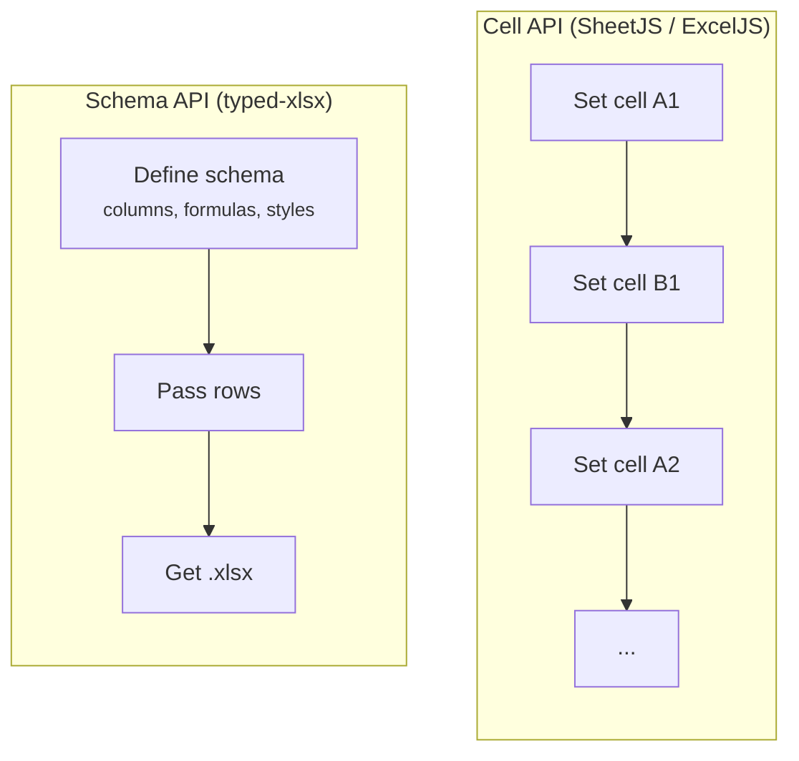

`typed-xlsx`, [hucre](https://github.com/productdevbook/hucre), SheetJS, and ExcelJS can all produce valid spreadsheets. The difference is scope.

`typed-xlsx` is deliberately focused: it is built for **advanced, repeatable, schema-driven XLSX reports** with strong compile-time guarantees.

`hucre` is deliberately broader: a **zero-dependency spreadsheet engine** for TypeScript with read/write XLSX, CSV, and ODS support, streaming, schema validation, round-trip preservation, and a wider workbook feature surface.

SheetJS and ExcelJS remain strong lower-level alternatives depending on whether you care more about interoperability or imperative workbook editing.

## Pick by goal

| Goal                                                                              | Best fit     | Why                                                                                            |
| --------------------------------------------------------------------------------- | ------------ | ---------------------------------------------------------------------------------------------- |
| Complex report authoring with formulas, reusable schemas, and compile-time safety | `typed-xlsx` | Type-safe schema DSL, compile-time-safe formula references, reusable schemas, streaming parity |
| Dynamic spreadsheet work with broad feature scope                                 | `hucre`      | Zero dependencies, read/write XLSX CSV ODS, round-trip preservation, schema validation         |
| Parsing, conversion, and broad spreadsheet interoperability                       | SheetJS      | Mature import/export surface across spreadsheet formats                                        |
| Imperative workbook editing with rich worksheet features                          | ExcelJS      | Row/cell builder with charts, images, rich text, and comments                                  |

## Feature matrix

| Feature                           |             `typed-xlsx`             |                 `hucre`                  |                 SheetJS                 |      ExcelJS       |
| --------------------------------- | :----------------------------------: | :--------------------------------------: | :-------------------------------------: | :----------------: |
| **Best fit**                      |        Advanced typed reports        |         Broad spreadsheet engine         |          Interop / conversion           | Imperative editing |
| **Programming model**             |              Schema DSL              |            Workbook/data API             |                Cell API                 |    Row/cell API    |
| **Zero runtime deps**             |          :white_check_mark:          |            :white_check_mark:            |             :warning: mixed             |        :x:         |
| **Read existing `.xlsx`**         |                 :x:                  |            :white_check_mark:            |           :white_check_mark:            | :white_check_mark: |
| **Write `.xlsx`**                 |          :white_check_mark:          |            :white_check_mark:            |           :white_check_mark:            | :white_check_mark: |
| **CSV / ODS**                     |              :x: / :x:               | :white_check_mark: / :white_check_mark:  | :white_check_mark: / :white_check_mark: |     :x: / :x:      |
| **Typed report DSL**              |          :white_check_mark:          |                :warning:                 |                   :x:                   |        :x:         |
| **Formula API**                   | :white_check_mark: compile-time safe | :warning: builder, not compile-time safe |               :x: strings               |    :x: strings     |
| **Advanced reporting**            |          :white_check_mark:          |                :warning:                 |                   :x:                   |  :warning: manual  |
| **Streaming write**               |      :white_check_mark: parity       |            :white_check_mark:            |            :warning: limited            | :warning: limited  |
| **Round-trip save**               |                 :x:                  |            :white_check_mark:            |            :warning: partial            | :warning: partial  |
| **Import validation**             |                 :x:                  |            :white_check_mark:            |            :warning: partial            |        :x:         |
| **Rich worksheet features**       |                 :x:                  |            :white_check_mark:            |             :warning: mixed             | :white_check_mark: |
| **HTML / Markdown / JSON export** |                 :x:                  |            :white_check_mark:            |            :warning: partial            |        :x:         |

:white_check_mark: Supported&ensp; :warning: Partial / manual&ensp; :x: Not supported

---

## typed-xlsx vs hucre

This is the most important comparison on this page.

- Choose `typed-xlsx` when your workbook shape is intentionally designed up front and you want the report definition itself to be part of your TypeScript contract.
- Choose `hucre` when you want a dependency-free spreadsheet engine with broader scope: read existing workbooks, parse and rewrite files, convert formats, preserve unknown workbook parts, validate imported data, or work across XLSX, CSV, and ODS from one library.

In short:

- **Advanced structured reports with a type-safe DSL and compile-time-safe formulas** -> `typed-xlsx`
- **Dynamic spreadsheet workflows with broader feature scope** -> `hucre`

`typed-xlsx` narrows scope around one job: making complex application reports safer to author and easier to maintain over time.

`hucre` has a much wider surface area. If your main requirement is spreadsheet I/O breadth, parsing, rewriting, and general workbook capability rather than report-specific compile-time guarantees, it is the better fit.

---

## The core difference: cell API vs schema API



SheetJS and ExcelJS are **cell APIs**. `hucre` is a **general spreadsheet engine**. `typed-xlsx` is a **report schema API**.

With lower-level libraries, you assemble workbook structure more directly. With `typed-xlsx`, you define the report shape once and reuse it.

```ts
// SheetJS — you manage cell addresses and format strings manually
import * as XLSX from "xlsx";

const ws: XLSX.WorkSheet = {};
ws["A1"] = { v: "Invoice #", t: "s" };
ws["B1"] = { v: "Total", t: "s" };
ws["A2"] = { v: "INV-001", t: "s" };
ws["B2"] = { v: 2990, t: "n", z: "$#,##0.00" };

const wb = XLSX.utils.book_new();
XLSX.utils.book_append_sheet(wb, ws, "Invoices");
XLSX.writeFile(wb, "invoices.xlsx");
```

```ts
// ExcelJS — row-by-row, cells by index
import ExcelJS from "exceljs";

const wb = new ExcelJS.Workbook();
const ws = wb.addWorksheet("Invoices");
ws.columns = [
  { header: "Invoice #", key: "id", width: 14 },
  { header: "Total", key: "total", width: 14 },
];
ws.addRow({ id: "INV-001", total: 2990 });
await wb.xlsx.writeFile("invoices.xlsx");
```

```ts
// typed-xlsx — declare the schema once, pass rows
import { createExcelSchema, createWorkbook } from "typed-xlsx";

type Invoice = { id: string; total: number };

const schema = createExcelSchema<Invoice>()
  .column("id", { header: "Invoice #", accessor: "id", width: 14 })
  .column("total", {
    header: "Total",
    accessor: "total",
    width: 14,
    style: { numFmt: "$#,##0.00" },
  })
  .build();

const workbook = createWorkbook();
workbook.sheet("Invoices").table("invoices", { rows: [], schema });
await workbook.writeToFile("invoices.xlsx");
```

The schema is a separate, stateless object. It is not bound to a workbook, sheet, or runtime state.

---

## What typed-xlsx is specifically better at

This is where `typed-xlsx` earns its narrower scope.

### Type safety

The schema is parameterized by your row type `T`. Accessors are checked, and formula references are validated at definition time.

```ts
type Order = { orderId: string; amount: number; region: string };

const schema = createExcelSchema<Order>()
  .column("id", { accessor: "orderId" })
  .column("region", { accessor: (row) => row.region.toUpperCase() })
  .build();
```

```ts
const schema = createExcelSchema<{ qty: number; price: number }>()
  .column("qty", { accessor: "qty" })
  .column("price", { accessor: "price" })
  .column("total", {
    formula: ({ refs, fx }) => fx.round(refs.column("qty").mul(refs.column("price")), 2),
  })
  .build();
```

### Reusable report schemas

One schema can power multiple exports with different row sets, contexts, or column selections.

```ts
const schema = createExcelSchema<SalesRow>()
  .column("region", { accessor: "region" })
  .column("revenue", { accessor: "revenue" })
  .column("cost", { accessor: "cost" })
  .column("margin", { accessor: "margin" })
  .build();

workbook.sheet("External").table("sales", {
  rows,
  schema,
  select: { exclude: ["cost", "margin"] },
});

workbook.sheet("Internal").table("sales", { rows, schema });
```

### Native Excel tables inside the same authoring model

`typed-xlsx` treats classic report layouts and native Excel tables as two modes of the same schema surface.

```ts
const schema = createExcelSchema<SalesRow>({ mode: "excel-table" })
  .column("region", { header: "Region", accessor: "region" })
  .column("revenue", {
    header: "Revenue",
    accessor: "revenue",
    style: { numFmt: "$#,##0.00" },
    totalsRow: { function: "sum" },
  })
  .build();
```

### Streaming with schema parity

The streaming builder keeps the same schema model as the buffered builder. It is not a degraded API.

### Formula authoring

This is one of the biggest practical differences.

`typed-xlsx`'s formula API is built into the schema model and stays tied to typed column IDs. That means formula authoring remains part of the compile-time-safe report definition instead of becoming a string or loosely typed builder problem.

```ts
const workbook = createWorkbookStream();
const table = await workbook.sheet("Orders").table("orders", { schema });

for await (const batch of databaseCursor()) {
  await table.commit({ rows: batch });
}

await workbook.writeToFile("./orders.xlsx");
```

---

## Where hucre, SheetJS, and ExcelJS win

`typed-xlsx` is a **write-only** library focused on stable report generation. It does not try to cover every spreadsheet use case.

- **hucre** — best when you want a broader spreadsheet engine that is still zero-dependency: read/write across XLSX, CSV, and ODS, parse and rewrite existing files, preserve workbook structure, validate imported data, or work with a wider set of workbook features from one library.
- **ExcelJS** — best when you need lower-level workbook manipulation plus charts, images, and rich text.
- **SheetJS** — best when you need parsing, conversion, and broad spreadsheet interoperability.

Some examples:

- **Reading / parsing** — `hucre`, SheetJS, and ExcelJS can read existing `.xlsx` files. `typed-xlsx` is write-only.
- **Multi-format support** — `hucre` and SheetJS support workflows beyond `.xlsx`. `typed-xlsx` only writes `.xlsx`.
- **Round-trip preservation** — `hucre` is a much better fit when you need to open, modify, and save existing workbooks without dropping unknown parts.
- **Images / comments / rich text** — `hucre` and ExcelJS cover a broader worksheet feature surface than `typed-xlsx`.
- **Schema validation / import tools** — `hucre` ships more import-oriented tooling than `typed-xlsx`.
- **Quick generation from mixed spreadsheet workflows** — `hucre` is a better fit when the job is broader than report authoring and you want one general engine.

If you need broad spreadsheet I/O, richer workbook manipulation, parsing, rewriting, or a faster path for dynamic spreadsheet tasks, `hucre` is the strongest dependency-free option to look at. `typed-xlsx` is designed for a narrower job: generating advanced typed XLSX reports from structured application data.

---

## Summary

If your primary need is **advanced structured reports with an extensive type-safe DSL**, choose `typed-xlsx`.

If your primary need is **a broader spreadsheet engine with zero dependencies, multi-format support, parsing, rewriting, and wider workbook features**, choose `hucre`.

If you specifically need conversion-heavy interoperability, choose SheetJS. If you specifically need imperative workbook editing with chart/image-heavy workflows, choose ExcelJS.
