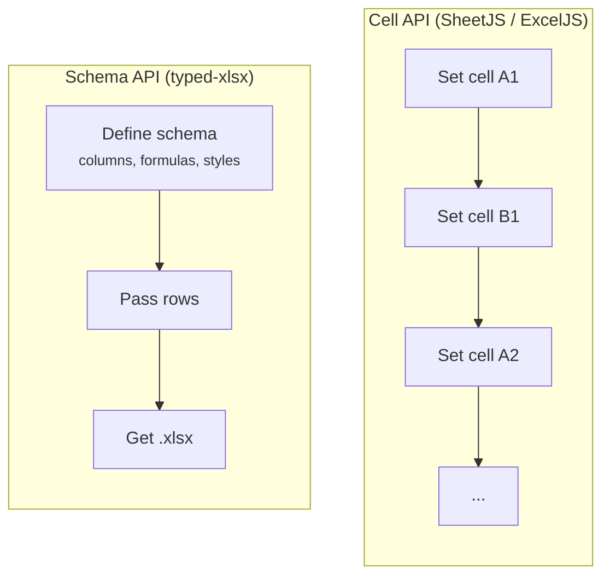

`typed-xlsx`, SheetJS, and ExcelJS can all produce valid spreadsheets. The difference is the authoring model.

`typed-xlsx` is deliberately focused: it is built for **advanced, repeatable, schema-driven XLSX reports** with strong compile-time guarantees.

SheetJS and ExcelJS are broader lower-level alternatives. They are strong choices when you need parsing, format conversion, or imperative workbook editing.

## Pick by goal

| Goal                                                                              | Best fit     | Why                                                                                            |
| --------------------------------------------------------------------------------- | ------------ | ---------------------------------------------------------------------------------------------- |
| Complex report authoring with formulas, reusable schemas, and compile-time safety | `typed-xlsx` | Type-safe schema DSL, compile-time-safe formula references, reusable schemas, streaming parity |
| Parsing, conversion, and broad spreadsheet interoperability                       | SheetJS      | Mature import/export surface across spreadsheet formats                                        |
| Imperative workbook editing with rich worksheet features                          | ExcelJS      | Row/cell builder with charts, freeform drawings, rich text, and comments                       |

## Feature matrix

| Feature                           |             `typed-xlsx`             |                 SheetJS                 |      ExcelJS       |
| --------------------------------- | :----------------------------------: | :-------------------------------------: | :----------------: |
| **Best fit**                      |        Advanced typed reports        |          Interop / conversion           | Imperative editing |
| **Programming model**             |              Schema DSL              |                Cell API                 |    Row/cell API    |
| **Zero runtime deps**             |          :white_check_mark:          |             :warning: mixed             |        :x:         |
| **Read existing `.xlsx`**         |                 :x:                  |           :white_check_mark:            | :white_check_mark: |
| **Write `.xlsx`**                 |          :white_check_mark:          |           :white_check_mark:            | :white_check_mark: |
| **CSV / ODS**                     |              :x: / :x:               | :white_check_mark: / :white_check_mark: |     :x: / :x:      |
| **Typed report DSL**              |          :white_check_mark:          |                   :x:                   |        :x:         |
| **Formula API**                   | :white_check_mark: compile-time safe |               :x: strings               |    :x: strings     |
| **Advanced reporting**            |          :white_check_mark:          |                   :x:                   |  :warning: manual  |
| **Streaming write**               |      :white_check_mark: parity       |            :warning: limited            | :warning: limited  |
| **Round-trip save**               |                 :x:                  |            :warning: partial            | :warning: partial  |
| **Import validation**             |                 :x:                  |            :warning: partial            |        :x:         |
| **Rich worksheet features**       |              :warning:               |             :warning: mixed             | :white_check_mark: |
| **HTML / Markdown / JSON export** |                 :x:                  |            :warning: partial            |        :x:         |

:white_check_mark: Supported&ensp; :warning: Partial / manual&ensp; :x: Not supported

---

## The core difference: cell API vs schema API

```mermaid
flowchart TB
  subgraph cell["Cell API (SheetJS / ExcelJS)"]
    direction TB
    C1["Set cell A1"] --> C2["Set cell B1"] --> C3["Set cell A2"] --> C4["..."]
  end

  subgraph schema["Schema API (typed-xlsx)"]
    direction TB
    S1["Define schema<br/><small>columns, formulas, styles</small>"]
    S2["Pass rows"]
    S3["Get .xlsx"]
    S1 --> S2 --> S3
  end
```

SheetJS and ExcelJS are **cell APIs**. `typed-xlsx` is a **report schema API**.

With lower-level libraries, you assemble workbook structure more directly. With `typed-xlsx`, you define the report shape once and reuse it across buffered exports, streaming exports, column selections, and different row sets.

---

## What typed-xlsx is specifically better at

### Type safety

The schema is parameterized by your row type `T`. Accessors are checked, and formula references are validated at definition time.

That means the report contract lives in TypeScript instead of in scattered cell addresses, string formulas, and manual row-building code.

### Reusable report schemas

One schema can power multiple exports with different row sets, contexts, or column selections.

The schema is a separate, stateless object. It is not bound to a workbook, sheet, or runtime state.

### Native Excel tables inside the same authoring model

`typed-xlsx` treats classic report layouts and native Excel tables as two modes of the same schema surface.

Use report mode for titles, grouped headers, sub-row expansion, and summaries. Use Excel table mode when you want native tables, autoFilter, structured refs, and totals rows.

### Streaming with schema parity

The streaming builder keeps the same schema model as the buffered builder. It is not a degraded API.

You can batch-commit rows without switching away from typed accessors, formulas, validation, styles, hyperlinks, sparklines, badges, checkboxes, or image renderer columns.

### Renderer columns

Renderer columns keep common export patterns close to the schema:

- badges for status-like values
- checkboxes for boolean values
- hyperlinks for external or internal links
- sparklines for row-level trends
- embedded or URL-backed image columns for product thumbnails and media catalogs

---

## Where SheetJS and ExcelJS win

`typed-xlsx` is a **write-only** library focused on stable report generation. It does not try to cover every spreadsheet use case.

- **SheetJS** is a strong fit when you need parsing, conversion, and broad spreadsheet interoperability.
- **ExcelJS** is a strong fit when you need lower-level workbook manipulation plus charts, freeform drawings, comments, and rich text.

Some examples:

- **Reading / parsing** — SheetJS and ExcelJS can read existing `.xlsx` files. `typed-xlsx` is write-only.
- **Multi-format support** — SheetJS supports workflows beyond `.xlsx`. `typed-xlsx` only writes `.xlsx`.
- **Round-trip preservation** — choose a lower-level library when you need to open, modify, and save existing workbooks without dropping unknown parts.
- **Freeform worksheet features** — `typed-xlsx` supports schema-driven image columns, but ExcelJS has a broader worksheet feature surface for charts, arbitrary drawings, comments, and rich text.
- **Manual workbook editing** — lower-level APIs are better when you need direct cell-by-cell control.

---

## Summary

Choose `typed-xlsx` when your primary need is **advanced structured reports with an extensive type-safe DSL**.

Choose SheetJS when you need conversion-heavy interoperability. Choose ExcelJS when you specifically need imperative workbook editing with chart, drawing, or comment-heavy workflows.
