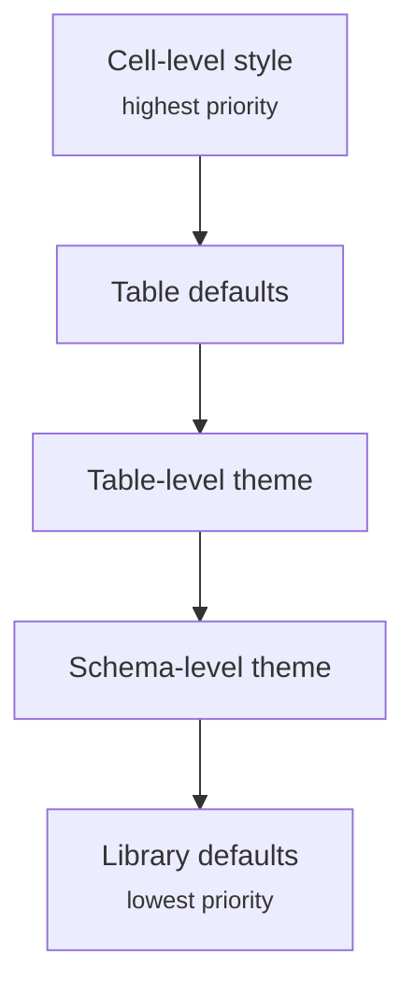

Themes let you package reusable spreadsheet styling into semantic slots and apply them consistently at the schema or table level.

Use them when you want a shared visual system rather than repeating raw `CellStyle` objects across columns, summaries, and workbook tables.

## Styling layers

| Layer              | Applied through                                                 | Best for                                                                |
| ------------------ | --------------------------------------------------------------- | ----------------------------------------------------------------------- |
| Theme slots        | `defineSpreadsheetTheme(...)`, schema `.theme()`, table `theme` | Shared defaults for titles, headers, summaries, and body cell states    |
| Cell styles        | `style: CellStyle`, `headerStyle`                               | Stable formatting such as number formats, alignment, fills, and borders |
| Dynamic styles     | `style: ({ row, rowIndex, subRowIndex, ctx }) => CellStyle`     | Styling based on source row data known to JavaScript                    |
| Conditional styles | `conditionalStyle`                                              | Styling that should react to formulas or later user edits in Excel      |

For the column-level APIs behind those layers, see [Cell Styles](/styling/cell-styles), [Dynamic Styles](/styling/dynamic-styles), and [Conditional Styles](/styling/conditional-styles).

## Defining a theme

Use `defineSpreadsheetTheme(...)` to create a reusable theme with semantic slots like `title`, `groupHeader`, `header`, `summary`, and body-cell states.

```ts twoslash
import { createExcelSchema, defineSpreadsheetTheme, createWorkbook } from "xlsmith";

type Deal = { amount: number; owner: string };

const boardTheme = defineSpreadsheetTheme({
  slots: {
    title: { fill: { color: { rgb: "020617" } }, font: { color: { rgb: "F8FAFC" }, bold: true } },
    header: { fill: { color: { rgb: "0B1220" } }, font: { color: { rgb: "F8FAFC" }, bold: true } },
    summary: { fill: { color: { rgb: "E0E7FF" } } },
  },
});

const watchlistTheme = boardTheme.extend({
  slots: {
    title: { fill: { color: { rgb: "450A0A" } } },
    groupHeader: { fill: { color: { rgb: "FECACA" } }, font: { color: { rgb: "9F1239" } } },
  },
});

const schema = createExcelSchema<Deal>()
  .theme(boardTheme)
  .column("owner", { accessor: "owner", style: boardTheme.slot("cellBase") })
  .column("amount", { accessor: "amount" })
  .build();

createWorkbook().sheet("Board").table("deals", {
  title: "Executive Watchlist",
  rows: [],
  schema,
  theme: watchlistTheme,
});
```

You can also cherry-pick theme slots anywhere a `CellStyle` is accepted:

```ts twoslash
import { defineSpreadsheetTheme } from "xlsmith";

const theme = defineSpreadsheetTheme();

theme.slot("header");
theme.slot("header", { alignment: { horizontal: "left" } });
```

## Theme precedence

When multiple layers contribute style information, precedence is (highest to lowest):



## Schema theme vs table theme

Schema-level themes are a good fit for reusable report modules. Table-level themes are useful when one workbook needs several visual variants of the same schema.

```ts twoslash
import { createExcelSchema, defineSpreadsheetTheme, createWorkbook } from "xlsmith";

type Deal = { amount: number; owner: string };

const baseTheme = defineSpreadsheetTheme({
  slots: {
    header: { font: { bold: true, color: { rgb: "F8FAFC" } }, fill: { color: { rgb: "1E293B" } } },
  },
});

const warmTheme = baseTheme.extend({
  slots: {
    header: { fill: { color: { rgb: "7C2D12" } } },
  },
});

const schema = createExcelSchema<Deal>()
  .theme(baseTheme)
  .column("owner", { accessor: "owner" })
  .column("amount", { accessor: "amount" })
  .build();

createWorkbook().sheet("Board").table("deals", {
  rows: [],
  schema,
  theme: warmTheme,
});
```

## Protection caveat

Themes affect visual defaults, but worksheet protection still lives in regular cell styles and sheet options.

- `conditionalStyle` is visual only
- it cannot configure worksheet protection (`locked` / `hidden`)
- protection stays a regular cell style concern and only takes effect when the sheet itself is protected

For the concrete APIs, see:

- [Cell Styles](/styling/cell-styles)
- [Dynamic Styles](/styling/dynamic-styles)
- [Conditional Styles](/styling/conditional-styles)
