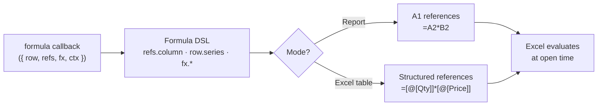

A formula column does not compute a value in JavaScript. It declares how a formula string should be assembled at output time. The library emits the formula string into the XLSX cell XML — Excel evaluates it when the file is opened.

This means formula columns are live: if someone edits a source cell in Excel, the formula column recalculates automatically.

Some spreadsheet viewers and importers do not recalculate formulas immediately. Excel desktop does, but if live recalculation matters for your consumers, test the target viewer.

Because formula cells stay live in Excel, they also pair well with `conditionalStyle`: you can reuse the same formula DSL to apply native Excel conditional formatting that reacts to formula results after the workbook opens.



## Basic syntax

```ts twoslash
import { createExcelSchema } from "xlsmith";

const schema = createExcelSchema<{ qty: number; unitPrice: number }>()
  .column("qty", { header: "Qty", accessor: "qty" })
  .column("unitPrice", { header: "Unit Price", accessor: "unitPrice" })
  .column("total", {
    header: "Total",
    formula: ({ row, refs }) => refs.column("qty").mul(refs.column("unitPrice")),
    style: { numFmt: "$#,##0.00" },
  })
  .build();
```

The `formula` callback receives `{ row, refs, fx, ctx }`:

- `row` — the row context, used for row-aware helpers like `row.series(...)`
- `refs` — selector-style helpers for `refs.column(...)`, `refs.group(...)`, and `refs.dynamic(...)`
- `fx` — the formula functions object (`round`, `abs`, `min`, `max`, `if`, `and`, `or`, `not`)
- `ctx` — the schema-level context object from `createExcelSchema<Row, Context>()`

Single-cell predecessor references now go through `refs.column(...)`. `row` is reserved for row-aware helpers like `row.series(...)`.

## Row model

The most important concept in report-mode formulas is the distinction between **logical rows** and **physical rows**:

- `refs.column(...)` targets the current physical-row cell
- `row.series(...)` targets the full physical-row span produced by the current logical row

For the full mental model, diagrams, and operator examples, see [Row Model](/formulas/row-model).

```ts twoslash
import { createExcelSchema } from "xlsmith";

const schema = createExcelSchema<{ customer: string; monthlyAmounts: number[] }>()
  .column("customer", { accessor: "customer" })
  .column("monthlyAmount", {
    accessor: (row) => row.monthlyAmounts,
    style: { numFmt: '"$"#,##0.00' },
  })
  .column("rowAverage", {
    formula: ({ row, refs, fx }) => fx.round(row.series("monthlyAmount").average(), 2),
    expansion: "single",
    style: { numFmt: '"$"#,##0.00' },
  })
  .build();
```

If `monthlyAmounts` expands to rows `B2:B4`, `row.series("monthlyAmount").average()` becomes `AVERAGE(B2:B4)`.

## `refs.column(...)` vs `row.series(...)`

Use `refs.column(columnId)` when the formula should operate on the current physical row cell.

Use `row.series(columnId)` when the formula should operate on the whole logical row's expanded values.

Typical examples:

- `refs.column("qty").mul(refs.column("unitPrice"))`: per-physical-row line total
- `row.series("monthlyAmount").sum()`: total across all expanded sub-rows for the current logical row
- `row.series("marginPct").min()`: minimum margin across all sub-rows in the current logical row

## Formula expansion

Formula columns support `expansion` to control whether one logical-row formula result should repeat across expanded physical rows or collapse into one merged cell.

Available values:

- `"auto"` (default): infer from the formula
- `"single"`: emit one formula cell for the logical row and merge the remaining physical rows in that column
- `"expand"`: emit the formula on every physical row of the logical row

Inference rules in `"auto"`:

- formulas using `row.series(...)` are scalar by default, so they behave like `"single"`
- formulas that reference expanded predecessors with `refs.column(...)` are repeated by default, so they behave like `"expand"`

```ts twoslash
import { createExcelSchema } from "xlsmith";

const schema = createExcelSchema<{ amounts: number[] }>()
  .column("amount", {
    accessor: (row) => row.amounts,
  })
  .column("rowAverageOnce", {
    formula: ({ row, refs }) => row.series("amount").average(),
    expansion: "single",
  })
  .column("rowAverageRepeated", {
    formula: ({ row, refs }) => row.series("amount").average(),
    expansion: "expand",
  })
  .build();
```

For a logical row that expands to three physical rows:

- `rowAverageOnce` writes one `AVERAGE(A2:A4)` cell and merges the remaining two cells vertically
- `rowAverageRepeated` writes `AVERAGE(A2:A4)` on all three physical rows

## Row references

`refs.column(columnId)` references the value of another column in the same row. The column ID is type-checked — referencing a column that doesn't exist (or hasn't been declared yet) is a TypeScript error.

```ts twoslash
import { createExcelSchema } from "xlsmith";

const schema = createExcelSchema<{
  grossAmount: number;
  discountRate: number;
}>()
  .column("grossAmount", { header: "Gross", accessor: "grossAmount" })
  .column("discountRate", { header: "Discount %", accessor: "discountRate" })
  .column("discount", {
    header: "Discount",
    formula: ({ row, refs }) => refs.column("grossAmount").mul(refs.column("discountRate")),
    style: { numFmt: "$#,##0.00" },
  })
  .column("netAmount", {
    header: "Net",
    // Can reference formula columns declared earlier
    formula: ({ row, refs }) => refs.column("grossAmount").sub(refs.column("discount")),
    style: { numFmt: "$#,##0.00" },
  })
  .build();
```

## Arithmetic operators

Operands returned by `refs.column()` and `fx.*` functions all expose `.add()`, `.sub()`, `.mul()`, `.div()`. Primitive literals can be passed directly. When the denominator may be zero, prefer `fx.safeDiv(...)` over manually wrapping `.div()` in `fx.if(...)`.

```ts twoslash
import { createExcelSchema } from "xlsmith";

const schema = createExcelSchema<{
  revenue: number;
  cost: number;
  taxRate: number;
}>()
  .column("revenue", { accessor: "revenue" })
  .column("cost", { accessor: "cost" })
  .column("taxRate", { accessor: "taxRate" })
  .column("grossMargin", {
    header: "Gross Margin",
    formula: ({ row, refs }) => refs.column("revenue").sub(refs.column("cost")),
    style: { numFmt: "$#,##0.00" },
  })
  .column("marginPct", {
    header: "Margin %",
    // (revenue - cost) / revenue
    formula: ({ row, refs, fx }) =>
      fx.safeDiv(refs.column("revenue").sub(refs.column("cost")), refs.column("revenue")),
    style: { numFmt: "0.0%" },
  })
  .column("taxOwed", {
    header: "Tax Owed",
    formula: ({ row, refs }) => refs.column("grossMargin").mul(refs.column("taxRate")),
    style: { numFmt: "$#,##0.00" },
  })
  .build();
```

## Literal values

Primitive values are embedded directly into the formula. Useful for thresholds, rates, or magic numbers that should live in the Excel formula rather than the JavaScript layer:

```ts twoslash
import { createExcelSchema } from "xlsmith";

const schema = createExcelSchema<{ amount: number }>()
  .column("amount", { accessor: "amount" })
  .column("amountWithVat", {
    header: "Amount + VAT",
    // Embed the VAT rate as a constant in the formula
    formula: ({ row, refs }) => refs.column("amount").mul(1.2),
    style: { numFmt: "$#,##0.00" },
  })
  .build();
```

## Formula functions (`fx`)

The `fx` object exposes spreadsheet functions:

| Function                        | Description                              |
| ------------------------------- | ---------------------------------------- |
| `fx.round(value, decimals?)`    | `ROUND(value, decimals)` — defaults to 0 |
| `fx.abs(value)`                 | `ABS(value)`                             |
| `fx.safeDiv(a, b, fallback?)`   | `IF(b<>0, a/b, fallback)`                |
| `fx.safeDiv(a, b, { ... })`     | `IF(when ?? b<>0, a/b, fallback ?? 0)`   |
| `fx.min(...values)`             | `MIN(a, b, ...)`                         |
| `fx.max(...values)`             | `MAX(a, b, ...)`                         |
| `fx.if(condition, true, false)` | `IF(condition, whenTrue, whenFalse)`     |
| `fx.and(...conditions)`         | `AND(a, b, ...)`                         |
| `fx.or(...conditions)`          | `OR(a, b, ...)`                          |
| `fx.not(condition)`             | `NOT(condition)`                         |

```ts twoslash
import { createExcelSchema } from "xlsmith";

const schema = createExcelSchema<{
  activatedSeats: number;
  purchasedSeats: number;
  mrr: number;
}>()
  .column("activatedSeats", { accessor: "activatedSeats" })
  .column("purchasedSeats", { accessor: "purchasedSeats" })
  .column("mrr", { accessor: "mrr", style: { numFmt: "$#,##0.00" } })
  .column("utilization", {
    header: "Utilization",
    // Avoid divide-by-zero: IF(purchasedSeats <> 0, activated/purchased, 0)
    formula: ({ row, refs, fx }) =>
      fx.round(fx.safeDiv(refs.column("activatedSeats"), refs.column("purchasedSeats")), 4),
    style: { numFmt: "0.0%" },
  })
  .column("tier", {
    header: "Tier",
    // Classify account based on MRR and utilization
    formula: ({ row, refs, fx }) =>
      fx.if(
        refs.column("mrr").gte(5000).or(refs.column("utilization").gte(0.85)),
        "STRATEGIC",
        fx.if(refs.column("mrr").gte(1000), "GROWTH", "STARTER"),
      ),
  })
  .build();
```

When you need a stricter guard than just `b <> 0`, pass a callback so the engine reuses the supplied operands for you:

```ts twoslash
import { createExcelSchema } from "xlsmith";

const schema = createExcelSchema<{
  revenue: number;
  cost: number;
}>()
  .column("revenue", { accessor: "revenue" })
  .column("cost", { accessor: "cost" })
  .column("marginPct", {
    formula: ({ refs, fx }) =>
      fx.safeDiv(refs.column("revenue").sub(refs.column("cost")), refs.column("revenue"), {
        fallback: 0,
        when: ({ denominator }) => denominator.gt(0),
      }),
    style: { numFmt: "0.0%" },
  })
  .build();
```

## Comparison operators

Operands expose `.eq()`, `.neq()`, `.gt()`, `.gte()`, `.lt()`, `.lte()` — these return a `FormulaCondition` that can be passed to `fx.if()` or chained with `.and()` / `.or()` / `.not()`:

```ts twoslash
import { createExcelSchema } from "xlsmith";

const schema = createExcelSchema<{
  churnRisk: number;
  daysOverdue: number;
}>()
  .column("churnRisk", { accessor: "churnRisk" })
  .column("daysOverdue", { accessor: "daysOverdue" })
  .column("alert", {
    header: "Alert",
    formula: ({ row, refs, fx }) =>
      fx.if(
        refs.column("churnRisk").gte(0.7).or(refs.column("daysOverdue").gt(30)),
        "ACTION REQUIRED",
        fx.if(
          refs.column("churnRisk").gte(0.4).and(refs.column("daysOverdue").gt(0)),
          "MONITOR",
          "OK",
        ),
      ),
  })
  .build();
```

## Formula columns with `conditionalStyle`

`conditionalStyle` reuses the same condition DSL as `fx.if(...)` and other formula helpers, but instead of returning a cell value it emits native Excel conditional formatting rules for the column range.

Use it when styling should remain reactive inside Excel after someone edits source cells.

```ts twoslash
import { createExcelSchema } from "xlsmith";

type Deal = {
  amount: number;
  quota: number;
  status: "open" | "won" | "at-risk";
};

const schema = createExcelSchema<Deal>()
  .column("amount", {
    accessor: "amount",
    style: { numFmt: "$#,##0.00", alignment: { horizontal: "right" } },
  })
  .column("quota", {
    accessor: "quota",
    style: { numFmt: "$#,##0.00", alignment: { horizontal: "right" } },
  })
  .column("status", {
    accessor: "status",
  })
  .column("attainment", {
    formula: ({ row, refs, fx }) => fx.safeDiv(refs.column("amount"), refs.column("quota")),
    style: { numFmt: "0.0%", alignment: { horizontal: "right" } },
    conditionalStyle: (conditional) =>
      conditional
        .when(({ row, refs }) => refs.column("attainment").lt(0.5), {
          fill: { color: { rgb: "FEE2E2" } },
          font: { color: { rgb: "991B1B" }, bold: true },
        })
        .when(
          ({ row, refs, fx }) =>
            fx.and(refs.column("attainment").gte(1), refs.column("status").eq("won")),
          {
            fill: { color: { rgb: "DCFCE7" } },
            font: { color: { rgb: "166534" }, bold: true },
          },
        ),
  })
  .build();
```

`style` is still the base style for the column. Matching conditional rules overlay on top of that base formatting.

## Scope aggregation formulas

When columns are declared inside a structural `group(...)` or runtime `dynamic(...)`, a later formula column can aggregate that scope with `fx.sum(refs.group(id))`, `fx.average(refs.group(id))`, `fx.sum(refs.dynamic(id))`, and the related helpers.

This is useful for cross-region or cross-period totals where the contributing columns are grouped structurally or generated from runtime context:

```ts twoslash
import { createExcelSchema } from "xlsmith";

type RegionData = {
  amer: number;
  apac: number;
  emea: number;
};

const schema = createExcelSchema<RegionData>({ mode: "excel-table" })
  .group("regions", (group) => {
    group.column("amer", { header: "AMER", accessor: "amer", style: { numFmt: "$#,##0" } });
    group.column("apac", { header: "APAC", accessor: "apac", style: { numFmt: "$#,##0" } });
    group.column("emea", { header: "EMEA", accessor: "emea", style: { numFmt: "$#,##0" } });
  })
  .column("globalTotal", {
    header: "Global Total",
    formula: ({ refs, fx }) => fx.sum(refs.group("regions")),
    style: { numFmt: "$#,##0", font: { bold: true } },
  })
  .column("avgRegion", {
    header: "Avg / Region",
    formula: ({ refs, fx }) => fx.average(refs.group("regions")),
    style: { numFmt: "$#,##0.00" },
  })
  .build();
```

Available scope aggregate helpers: `fx.sum(...)`, `fx.average(...)`, `fx.min(...)`, `fx.max(...)`, `fx.count(...)`.

## Formula scope rules

Formula scope is **lexical and predecessor-based**:

- A formula column can only reference columns declared **before it** in the same schema
- Inside a `group(...)` or `dynamic(...)`, it can reference previous columns in that scope and outer columns preceding the scope
- Self-references and forward references are TypeScript errors
- Referencing columns declared inside a nested scope from outside that scope is not supported

Most invalid references are caught by TypeScript at declaration time. References that become invalid at runtime (e.g. a referenced column is excluded via `select`) throw during output.

## Output by mode

The formula DSL is identical in both modes. What differs is the formula string emitted into the XLSX:

| Mode        | Example output for `refs.column("qty").mul(refs.column("price"))` |
| ----------- | ----------------------------------------------------------------- |
| Report      | `=A2*B2` for this exact two-column example                        |
| Excel table | `=[@[Qty]]*[@[Price]]` (structured reference)                     |

Structured references in excel-table mode are stable across row insertions and deletions — a key advantage over A1 references when users edit the table.

## Worked example: SaaS billing export

A complete billing report that chains multiple formula columns to compute net revenue, commission, and payout — practical for an operations or finance team:

```ts twoslash
import { createExcelSchema } from "xlsmith";

const billingSchema = createExcelSchema<{
  dealId: string;
  accountName: string;
  contractValue: number;
  discountPct: number;
  commissionRate: number;
}>()
  .column("dealId", { header: "Deal ID", accessor: "dealId" })
  .column("accountName", { header: "Account", accessor: "accountName" })
  .column("contractValue", {
    header: "Contract Value",
    accessor: "contractValue",
    style: { numFmt: "$#,##0.00" },
  })
  .column("discountPct", {
    header: "Discount %",
    accessor: "discountPct",
    style: { numFmt: "0.0%" },
  })
  .column("commissionRate", {
    header: "Commission %",
    accessor: "commissionRate",
    style: { numFmt: "0.0%" },
  })
  .column("netRevenue", {
    header: "Net Revenue",
    formula: ({ row, refs, fx }) =>
      fx.round(refs.column("contractValue").mul(fx.literal(1).sub(refs.column("discountPct"))), 2),
    style: { numFmt: "$#,##0.00" },
  })
  .column("commission", {
    header: "Commission",
    formula: ({ row, refs, fx }) =>
      fx.round(refs.column("netRevenue").mul(refs.column("commissionRate")), 2),
    style: { numFmt: "$#,##0.00" },
  })
  .column("payout", {
    header: "Rep Payout",
    // Net revenue minus commission retained
    formula: ({ row, refs }) => refs.column("netRevenue").sub(refs.column("commission")),
    style: { numFmt: "$#,##0.00" },
  })
  .build();
```
