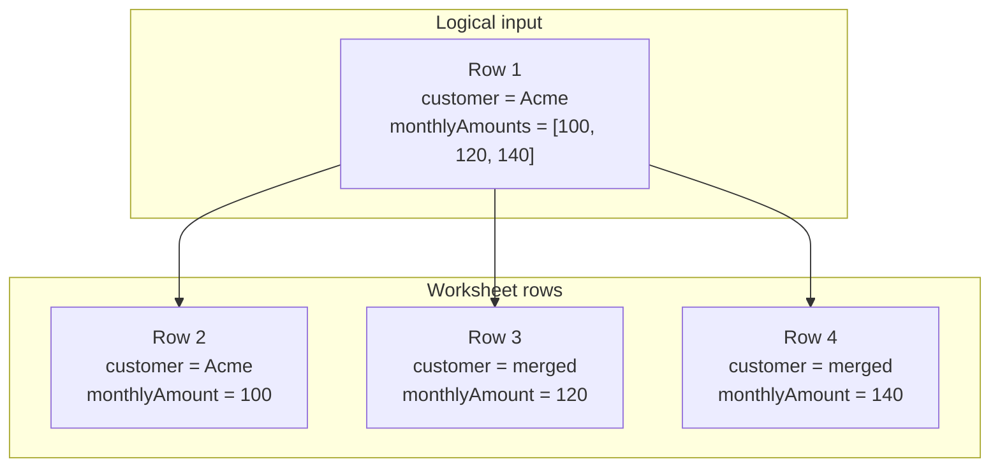
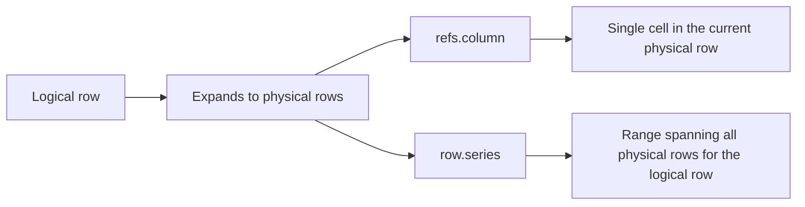
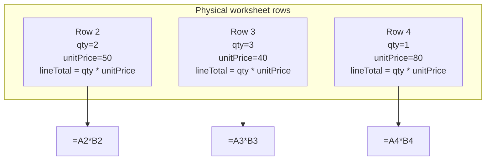
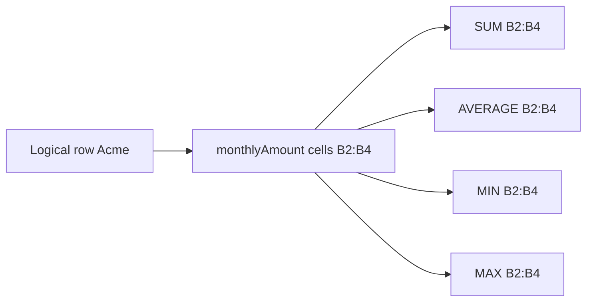
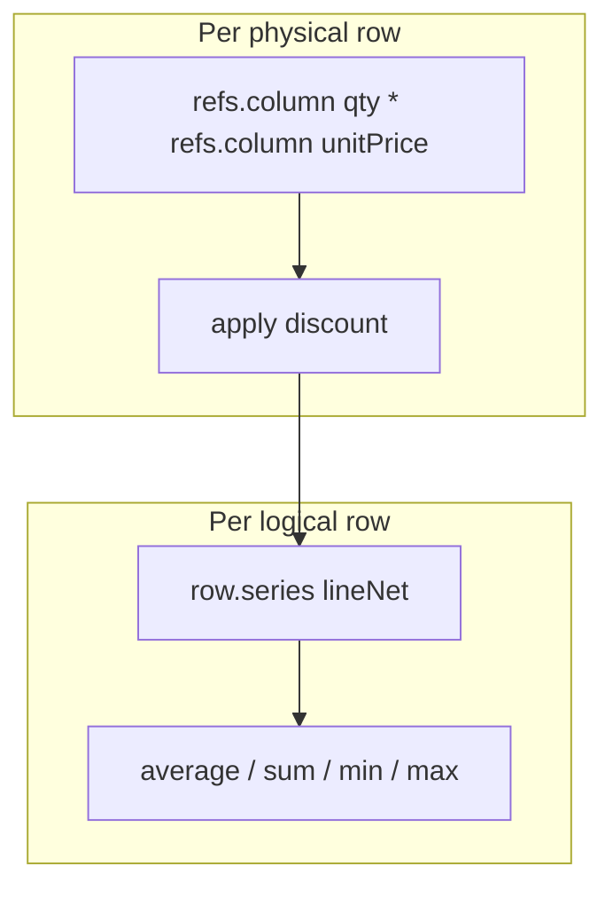
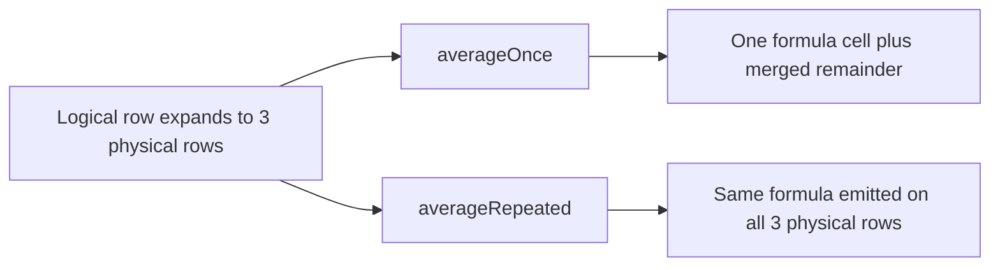
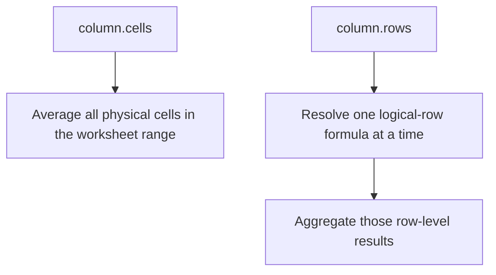
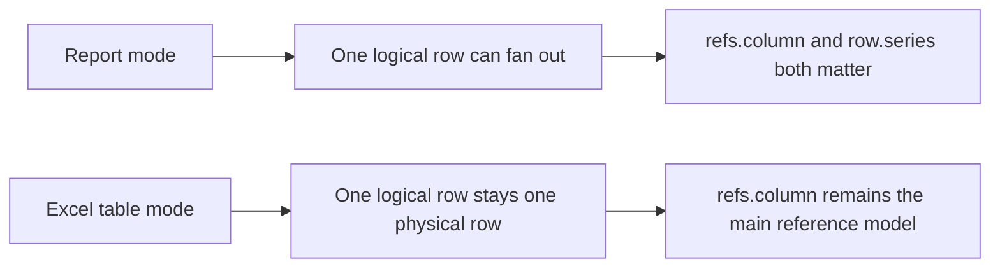

When formulas feel confusing in report mode, the issue is almost always the **row model**.

The short version:

- a **logical row** is one source object from your `rows` array
- a **physical row** is one actual worksheet row after expansion
- `refs.column(...)` works at the **physical row** level
- `row.series(...)` works at the **logical row** level by targeting the full expanded span
- `column.cells()` summarizes **physical cells**
- `column.rows()` summarizes **logical rows**

This page is the canonical explanation of that model.

## One input row can become many worksheet rows

In report mode, an accessor that returns an array expands one logical row into multiple physical rows.

```ts twoslash
import { createExcelSchema } from "xlsmith";

const schema = createExcelSchema<{
  customer: string;
  monthlyAmounts: number[];
}>()
  .column("customer", { accessor: "customer" })
  .column("monthlyAmount", {
    accessor: (row) => row.monthlyAmounts,
  })
  .build();
```

For this input:

```ts
{
  customer: "Acme",
  monthlyAmounts: [100, 120, 140],
}
```

`xlsmith` renders:

- `1` logical row
- `3` physical worksheet rows



That is the core distinction the formula APIs model.

## Mental model

Use this rule of thumb:

- reach for `refs.column(...)` when the formula should behave like “this worksheet row only”
- reach for `row.series(...)` when the formula should behave like “the whole original source row”



## `refs.column(...)` targets one physical-row cell

`refs.column(columnId)` means: reference the cell for that column on the **current physical worksheet row**.

```ts twoslash
import { createExcelSchema } from "xlsmith";

const schema = createExcelSchema<{
  qty: number[];
  unitPrice: number[];
}>()
  .column("qty", { accessor: (row) => row.qty })
  .column("unitPrice", { accessor: (row) => row.unitPrice })
  .column("lineTotal", {
    formula: ({ row, refs }) => refs.column("qty").mul(refs.column("unitPrice")),
    expansion: "expand",
  })
  .build();
```

If one logical row expands to three physical rows, the emitted formulas behave like this:



This is the right tool for:

- line totals
- per-sub-row margins
- comparisons that should track each emitted worksheet row separately

## `row.series(...)` targets the whole logical-row span

`row.series(columnId)` means: reference the **full range** of physical cells generated by the current logical row for that column.

```ts twoslash
import { createExcelSchema } from "xlsmith";

const schema = createExcelSchema<{ monthlyAmounts: number[] }>()
  .column("monthlyAmount", {
    accessor: (row) => row.monthlyAmounts,
  })
  .column("rowAverage", {
    formula: ({ row, refs, fx }) => fx.round(row.series("monthlyAmount").average(), 2),
    expansion: "single",
  })
  .build();
```

If `monthlyAmount` renders in `B2:B4`, then:

- `row.series("monthlyAmount").sum()` becomes `SUM(B2:B4)`
- `row.series("monthlyAmount").average()` becomes `AVERAGE(B2:B4)`



This is the right tool for:

- one-per-order totals across expanded line items
- one-per-customer averages across expanded monthly values
- formula cells that summarize a logical record instead of each worksheet row

## Operators compose the same way on both

One important point: `refs.column(...)` and `row.series(...)` both return formula objects you can keep composing.

That means the difference is not in the operators. The difference is in **what each operand points at**.

```ts twoslash
import { createExcelSchema } from "xlsmith";

const schema = createExcelSchema<{
  qty: number[];
  unitPrice: number[];
  discountPct: number;
}>()
  .column("qty", { accessor: (row) => row.qty })
  .column("unitPrice", { accessor: (row) => row.unitPrice })
  .column("discountPct", { accessor: "discountPct" })
  .column("lineNet", {
    formula: ({ row, refs, fx }) =>
      refs
        .column("qty")
        .mul(refs.column("unitPrice"))
        .mul(fx.literal(1).sub(refs.column("discountPct"))),
    expansion: "expand",
  })
  .column("orderAverage", {
    formula: ({ row, refs, fx }) => fx.round(row.series("lineNet").average(), 2),
    expansion: "single",
  })
  .build();
```

Read that as:

- `lineNet`: compute one value per physical row
- `orderAverage`: aggregate the whole logical row after those physical-row values exist



## Expansion controls where the result is written

The formula itself decides what to compute. `expansion` decides **how many cells receive the result**.

- `"auto"`: infer based on the formula shape
- `"single"`: write once for the logical row, merge remaining physical cells
- `"expand"`: repeat across every physical row of the logical row

```ts twoslash
import { createExcelSchema } from "xlsmith";

const schema = createExcelSchema<{ amounts: number[] }>()
  .column("amount", {
    accessor: (row) => row.amounts,
  })
  .column("averageOnce", {
    formula: ({ row, refs }) => row.series("amount").average(),
    expansion: "single",
  })
  .column("averageRepeated", {
    formula: ({ row, refs }) => row.series("amount").average(),
    expansion: "expand",
  })
  .build();
```



In practice:

- use `single` for “one rollup per logical record”
- use `expand` for “repeat the result on every emitted worksheet row”

## Summaries use the same row model idea

The same distinction appears in summary formulas.

- `column.cells()` aggregates all physical worksheet cells
- `column.rows()` aggregates logical rows first

```ts twoslash
import { createExcelSchema } from "xlsmith";

const schema = createExcelSchema<{ monthlyAmounts: number[] }>()
  .column("monthlyAmount", {
    accessor: (row) => row.monthlyAmounts,
    summary: (summary) => [
      summary.formula(({ column }) => column.cells().average()),
      summary.formula(({ column }) => column.rows().average((row) => row.cells().average())),
    ],
  })
  .build();
```



Use:

- `column.cells()` when the physical worksheet range is the thing you want to summarize
- `column.rows()` when you want each source row to count once, even if it expanded into many worksheet rows

## Report mode vs excel-table mode

This row model matters most in **report mode**, because report mode supports sub-row expansion.

In **excel-table mode**:

- sub-row expansion is not supported
- formulas still use the same DSL
- `refs.column(...)` emits structured references
- `row.series(...)` is not the practical center of the model because one logical row does not fan out into multiple worksheet rows



## Practical checklist

Use this checklist when deciding which API to use:

- use `refs.column(...)` for per-physical-row formulas
- use `row.series(...)` for per-logical-row formulas over expanded cells
- use `expansion: "single"` when one logical-row result should render once
- use `expansion: "expand"` when the same result should repeat on every physical row
- use `column.cells()` when summaries should operate on worksheet cells directly
- use `column.rows()` when summaries should respect source-row boundaries

## Related pages

- [Formula Columns](/formulas/formula-columns)
- [Scope & References](/formulas/scope-and-references)
- [Summary Formulas](/formulas/summary-formulas)
