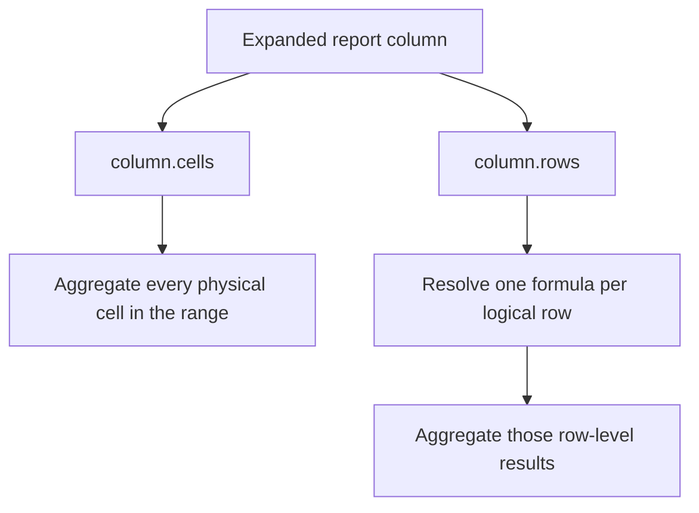
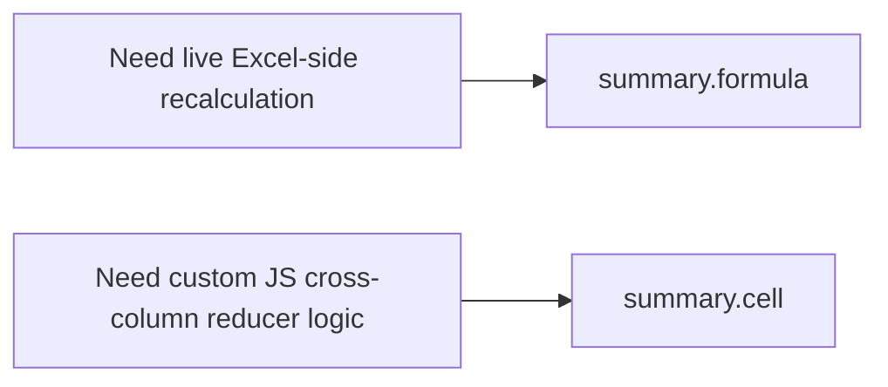

Summary cells can contain JavaScript-computed values (via `summary.cell()`) or Excel range formulas (via `summary.formula()`). Range formulas let Excel recalculate the summary if the user edits a cell — they stay live in the spreadsheet after export.

As with formula columns, some spreadsheet viewers and importers do not recalculate formulas immediately. Excel desktop does, but it is worth validating the viewers your users rely on.

Summary formulas are **report-mode only**. For excel-table mode, use the [totals row](/excel-tables/totals-row) instead.


## The summary formula context

The `summary.formula()` callback receives `{ column, fx }` — a different context from column formula callbacks:

| Parameter | Type                        | Description                                                                                         |
| --------- | --------------------------- | --------------------------------------------------------------------------------------------------- |
| `column`  | `SummaryColumnRangeContext` | The column's data range — use `.cells()` to get aggregate functions                                 |
| `fx`      | `FormulaFunctions`          | The same `fx` available in formula columns — `round`, `abs`, `min`, `max`, `if`, `and`, `or`, `not` |

```ts twoslash
import { createExcelSchema } from "typed-xlsx";

const schema = createExcelSchema<{ amount: number }>()
  .column("amount", {
    accessor: "amount",
    summary: (s) => [s.formula(({ column, fx }) => fx.round(column.cells().sum(), 2))],
  })
  .build();
```

## `column.cells()` — range aggregates

`column.cells()` returns the column's full data range and exposes five aggregate methods. Each method emits the corresponding Excel range formula string at output time:

| Method       | Emitted formula example |
| ------------ | ----------------------- |
| `.sum()`     | `=SUM(C2:C1001)`        |
| `.average()` | `=AVERAGE(C2:C1001)`    |
| `.count()`   | `=COUNT(C2:C1001)`      |
| `.min()`     | `=MIN(C2:C1001)`        |
| `.max()`     | `=MAX(C2:C1001)`        |

The row range (`C2:C1001`) is resolved from the table's actual first and last data rows at output time — not hardcoded.

## `column.rows()` — logical-row-aware aggregates

When a report contains sub-row expansion, `column.cells()` and `column.rows()` answer different questions:

- `column.cells()` aggregates across all physical worksheet rows in the column
- `column.rows()` aggregates across logical source rows, letting you resolve one formula per logical row first

This is the key distinction when one input row expands into multiple physical rows.



```ts twoslash
import { createExcelSchema } from "typed-xlsx";

const schema = createExcelSchema<{ customer: string; monthlyAmounts: number[] }>()
  .column("customer", {
    accessor: "customer",
    summary: (s) => [
      s.label("Physical average"),
      s.label("Logical average"),
      s.label("Logical sum"),
    ],
  })
  .column("monthlyAmount", {
    accessor: (row) => row.monthlyAmounts,
    summary: (s) => [
      s.formula(({ column }) => column.cells().average()),
      s.formula(({ column }) => column.rows().average((row) => row.cells().average())),
      s.formula(({ column }) => column.rows().sum((row) => row.cells().average())),
    ],
  })
  .build();
```

Mental model:

- `column.cells().average()` becomes one `AVERAGE(range)` over every physical row cell
- `column.rows().average((row) => row.cells().average())` computes one `AVERAGE(...)` per logical row, then averages those row-level results
- `column.rows().sum((row) => row.cells().average())` computes one `AVERAGE(...)` per logical row, then sums those row-level results

Use `column.rows()` whenever the worksheet has expanded sub-rows but the summary should respect original source-row boundaries.

## Composing with `fx`

The result of `column.cells().sum()` is a `FormulaExpr` that can be passed to any `fx.*` function:

```ts twoslash
import { createExcelSchema } from "typed-xlsx";

const schema = createExcelSchema<{
  revenue: number;
  units: number;
  cost: number;
}>()
  .column("revenue", {
    accessor: "revenue",
    style: { numFmt: "$#,##0.00" },
    summary: (s) => [
      // ROUND(SUM(range), 2)
      s.formula(({ column, fx }) => fx.round(column.cells().sum(), 2), {
        style: { numFmt: "$#,##0.00", font: { bold: true } },
      }),
    ],
  })
  .column("units", {
    accessor: "units",
    summary: (s) => [s.formula(({ column }) => column.cells().sum())],
  })
  .column("cost", {
    accessor: "cost",
    style: { numFmt: "$#,##0.00" },
    summary: (s) => [
      // MAX of the column range
      s.formula(({ column }) => column.cells().max(), {
        style: { numFmt: "$#,##0.00" },
      }),
    ],
  })
  .build();
```

## Shorthand strings

For the five standard aggregates, pass the string name instead of a callback:

```ts twoslash
import { createExcelSchema } from "typed-xlsx";

const schema = createExcelSchema<{
  revenue: number;
  sessions: number;
  bounceRate: number;
}>()
  .column("revenue", {
    accessor: "revenue",
    summary: (s) => [s.formula("sum")],
  })
  .column("sessions", {
    accessor: "sessions",
    summary: (s) => [s.formula("count")],
  })
  .column("bounceRate", {
    accessor: "bounceRate",
    summary: (s) => [s.formula("average")],
  })
  .build();
```

Available shorthands: `"sum"`, `"average"`, `"count"`, `"min"`, `"max"`.

## Style and format options

`summary.formula()` accepts an optional second argument with `style` and `format`:

```ts twoslash
import { createExcelSchema } from "typed-xlsx";

const schema = createExcelSchema<{ amount: number }>()
  .column("amount", {
    accessor: "amount",
    style: { numFmt: "$#,##0.00" },
    summary: (s) => [
      s.formula(({ column, fx }) => fx.round(column.cells().sum(), 2), {
        style: {
          numFmt: "$#,##0.00",
          font: { bold: true },
          fill: { color: { rgb: "EFF6FF" } },
        },
      }),
    ],
  })
  .build();
```

## Multiple summary formula rows

Return multiple definitions to produce multiple summary rows. Index 0 is the first summary row, index 1 is the second:

```ts twoslash
import { createExcelSchema } from "typed-xlsx";

// Financial report: net revenue row + gross revenue row
const schema = createExcelSchema<{ gross: number; discount: number }>()
  .column("label", {
    accessor: () => "",
    summary: (s) => [
      s.label("NET REVENUE", { style: { font: { bold: true } } }),
      s.label("GROSS REVENUE", { style: { font: { bold: true } } }),
    ],
  })
  .column("gross", {
    accessor: "gross",
    style: { numFmt: "$#,##0.00" },
    summary: (s) => [
      // Row 0: gross - discounts
      s.cell({
        init: () => ({ gross: 0, discount: 0 }),
        step: (acc, row) => ({
          gross: acc.gross + row.gross,
          discount: acc.discount + row.discount,
        }),
        finalize: (acc) => acc.gross - acc.discount,
        style: { numFmt: "$#,##0.00", font: { bold: true } },
      }),
      // Row 1: gross total as a live Excel formula
      s.formula(({ column }) => column.cells().sum(), {
        style: { numFmt: "$#,##0.00", font: { bold: true } },
      }),
    ],
  })
  .build();
```

## When to use formula vs cell

Use `summary.formula()` when:

- You want the summary to stay live and recalculate if a user edits the data in Excel
- The aggregate is a simple column range function (sum, average, count, min, max)

Use `summary.cell()` when:

- The summary requires cross-column logic (e.g. `gross - discounts`) not expressible as a single column range
- You need a precise JavaScript-computed value that Excel formulas can't express simply


