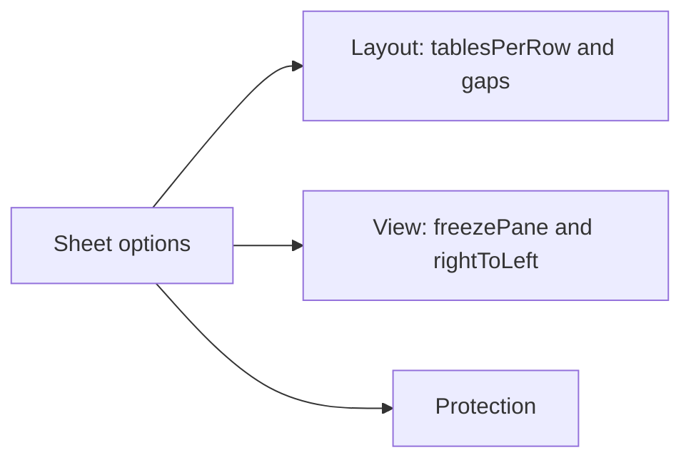
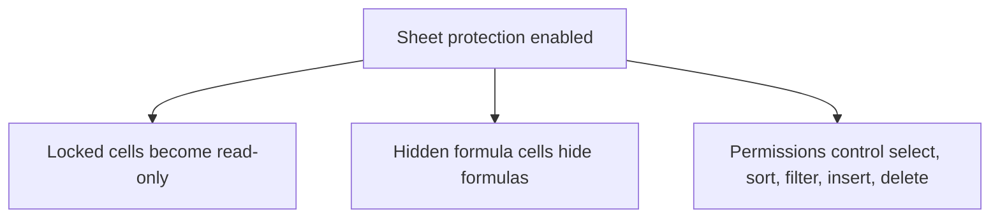

Create sheets with `.sheet(name, options?)`.

```ts twoslash
import { createWorkbook } from "typed-xlsx";

const workbook = createWorkbook();

workbook.sheet("Financial Overview", {
  tablesPerRow: 2,
  tableColumnGap: 2,
  tableRowGap: 1,
  freezePane: { rows: 1, columns: 2 },
});
```

Sheet options currently cover:

- `tablesPerRow`
- `tableColumnGap`
- `tableRowGap`
- `freezePane`
- `rightToLeft`
- `protection`



## Worksheet protection

Worksheet protection activates the `locked` and `hidden` flags stored on cell styles.



```ts twoslash
import { createExcelSchema, createWorkbook } from "typed-xlsx";

const schema = createExcelSchema<{ input: number; formulaValue: number }>()
  .column("input", {
    accessor: "input",
    style: {
      protection: { locked: false },
    },
  })
  .column("formulaValue", {
    formula: ({ row, refs }) => refs.column("input").mul(2),
    style: {
      protection: { hidden: true },
    },
  })
  .build();

const workbook = createWorkbook({
  protection: {
    password: "workbook-secret",
    structure: true,
  },
});

workbook
  .sheet("Protected", {
    freezePane: { rows: 1 },
    protection: {
      password: "sheet-secret",
      selectUnlockedCells: true,
      selectLockedCells: false,
    },
  })
  .table("protected", {
    schema,
    rows: [{ input: 5, formulaValue: 10 }],
  });
```

Use `protection: true` for the default protected-sheet behavior, or pass an object to control permissions such as:

- `password`
- `selectLockedCells`
- `selectUnlockedCells`
- `formatCells`
- `sort`
- `autoFilter`
- `insertRows`
- `deleteRows`

`Workbook.sheet()` and `WorkbookStream.sheet()` accept the same protection options.

The buffered builder fully supports multi-table sheet layouts. The stream builder now supports the same sheet layout options as well, though the most common large-export pattern is still one streamed table per sheet.

```ts twoslash
import { createWorkbookStream } from "typed-xlsx";

const workbook = createWorkbookStream();

workbook.sheet("Audit Log", {
  freezePane: { rows: 1 },
  rightToLeft: false,
});
```
