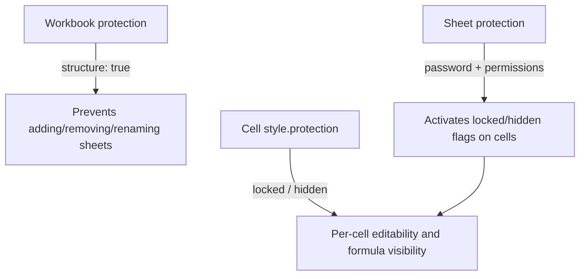

Protection in `typed-xlsx` has three layers:

- workbook protection controls structure-level actions like adding, removing, or renaming sheets
- sheet protection turns worksheet permissions on and off
- cell `style.protection` marks individual cells as locked or hidden

Cell-level protection only takes effect once the worksheet itself is protected.



## Cell-level protection

```ts twoslash
import { createExcelSchema } from "typed-xlsx";

const schema = createExcelSchema<{ input: number; formulaValue: number }>()
  .column("input", {
    accessor: "input",
    style: {
      protection: { locked: false },
    },
  })
  .column("formulaValue", {
    formula: ({ row, refs }) => refs.column("input").mul(2),
    style: {
      protection: { hidden: true },
    },
  })
  .build();
```

- `locked: false` keeps an otherwise protected cell editable
- `hidden: true` hides the formula from Excel's formula bar when the sheet is protected

## Sheet protection

```ts twoslash
import { createExcelSchema, createWorkbook } from "typed-xlsx";

const schema = createExcelSchema<{ input: number; formulaValue: number }>()
  .column("input", {
    accessor: "input",
    style: { protection: { locked: false } },
  })
  .column("formulaValue", {
    formula: ({ row, refs }) => refs.column("input").mul(2),
    style: { protection: { hidden: true } },
  })
  .build();

const workbook = createWorkbook();
workbook
  .sheet("Protected", {
    freezePane: { rows: 1 },
    protection: {
      password: "sheet-secret",
      selectUnlockedCells: true,
      selectLockedCells: false,
      sort: false,
      autoFilter: true,
    },
  })
  .table("data", {
    schema,
    rows: [{ input: 5, formulaValue: 10 }],
  });
```

Use `protection: true` for default protected-sheet behavior, or pass an object when you need explicit permissions.

## Workbook protection

```ts twoslash
import { createWorkbook } from "typed-xlsx";

const workbook = createWorkbook({
  protection: {
    password: "workbook-secret",
    structure: true,
  },
});
```

Workbook protection is about sheet structure, not cell editability.

## Effective behavior

- workbook protection locks workbook structure
- sheet protection enables protected-sheet behavior
- cell protection decides which cells stay editable or hidden inside that protected sheet

Conditional formatting cannot toggle `locked` or `hidden`, so protection always stays a regular `CellStyle` concern.

For the full option shapes, see [Sheet Options](/workbook/sheet-options).
