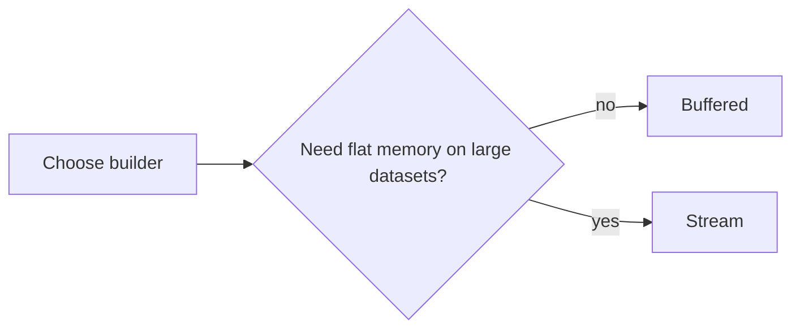
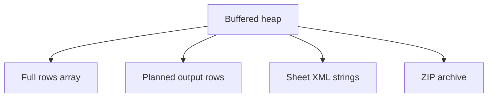
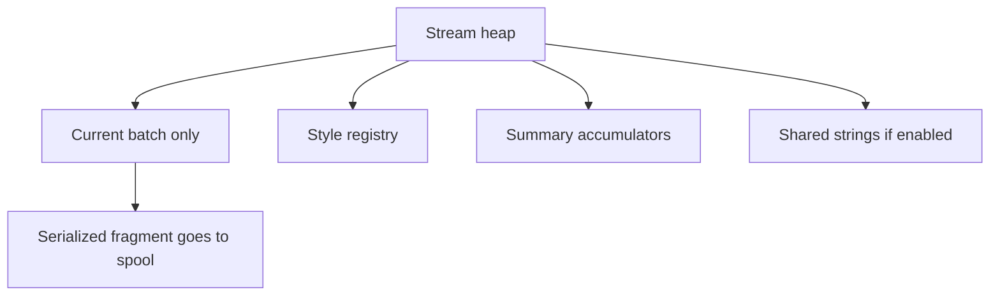
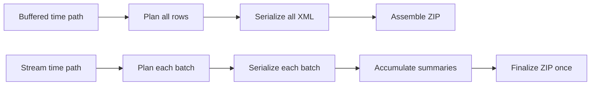
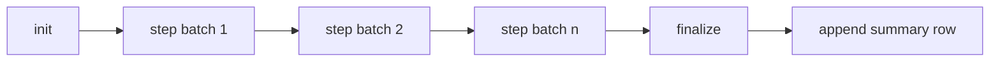

Understanding how `typed-xlsx` processes rows helps you make the right decisions for large-scale exports.



## Buffered mode memory model

In buffered mode, `createWorkbook()` holds everything in memory simultaneously:

1. Your full `rows: T[]` array as passed into `.table()`
2. The planned row output (expanded sub-rows, merged cells resolved)
3. The OOXML XML strings for the entire sheet
4. The in-memory ZIP archive

Peak heap is roughly proportional to `rows × avg-columns × avg-cell-size × 3–4×` for the multiple representation layers. A report with 10,000 rows and 30 columns of mostly string data sits comfortably in memory for most environments. A report with 300,000 rows of the same shape likely does not.



## Stream mode memory model

In stream mode, `createWorkbookStream()` holds only one batch in memory at a time:

1. The current `.commit({ rows })` batch while it's being serialized
2. The style registry (small — just deduplicated `CellStyle` objects)
3. Summary accumulators (one value per column per `summary` definition)
4. The shared string table, if `strings: "shared"` is active

Serialized XML fragments are appended to a spool (file or memory buffer) as each commit finishes. The final ZIP is assembled by streaming the spool contents — the compressor never loads the full workbook.



With `tempStorage: "file"` and `strings: "inline"`, peak heap is:

```
max(batch_size × columns × cell_overhead) + style_registry + accumulators
```

For a 5000-row batch with 20 columns, this is typically 10–50 MB depending on cell content, well within any production Node.js environment.

## Where time is spent

### Buffered

| Stage               | What happens                                                |
| ------------------- | ----------------------------------------------------------- |
| Row planning        | Sub-row expansion, merge resolution, auto-width computation |
| OOXML serialization | Row/cell XML string assembly for the full sheet             |
| Style normalization | Deduplication of all cell styles into an index              |
| ZIP assembly        | In-memory ZIP with deflate compression                      |

All stages complete before any output is produced. The total time scales linearly with row count.

### Stream

| Stage                | When it happens                                       |
| -------------------- | ----------------------------------------------------- |
| Row planning         | Per batch, during each `.commit()` call               |
| OOXML serialization  | Per batch, appended to spool immediately              |
| Summary accumulation | Per row, during each `.commit()` call via `step()`    |
| ZIP assembly         | At finalization — streams spool contents into the ZIP |

Commit calls scale linearly with batch size. Finalization time is dominated by ZIP compression of the already-serialized OOXML.



## Throughput characteristics

| Scenario                          | Typical throughput           |
| --------------------------------- | ---------------------------- |
| Buffered, 10k rows, 20 cols       | < 1s total                   |
| Buffered, 100k rows, 20 cols      | 3–8s, significant heap usage |
| Buffered, 500k rows               | Not recommended              |
| Stream, 100k rows, 5k-row batches | 4–10s, low heap              |
| Stream, 1M rows, 10k-row batches  | 40–90s, low heap             |

These are rough estimates. Actual time depends on cell content complexity, style count, auto-width computation, and system I/O.

## Summary accumulation and why it enables streaming

The pre-v1 summary API passed the full `rows: T[]` array to a value function. This meant summaries could not be computed until all rows were available, making stream mode impossible.

The reducer model (`init` / `step` / `finalize`) processes rows incrementally:

```ts twoslash
import { createExcelSchema } from "@chronicstone/typed-xlsx";

createExcelSchema<{ amount: number }>()
  .column("amount", {
    accessor: "amount",
    summary: (summary) => [
      summary.cell({
        init: () => 0, // called once at the start
        step: (acc, row) => acc + row.amount, // called per row, per batch
        finalize: (acc) => acc, // called once at finalization
        style: { numFmt: "#,##0.00", font: { bold: true } },
      }),
    ],
  })
  .build();
```

The accumulator is updated during each `.commit()` call as rows are processed. At finalization, `finalize()` is called once and the summary row is appended to the spool. No rows are held.



## Benchmarks

The repository ships dedicated stream benchmark tooling under `packages/benchmark/`. Treat the numbers below as directional until regenerated for your machine and branch.

### Generation time (stream mode, file-backed spool)

| Rows      | Batch size | Total time | Peak heap |
| --------- | ---------- | ---------- | --------- |
| 10,000    | 1,000      | ~0.3s      | ~60 MB    |
| 100,000   | 5,000      | ~2.1s      | ~80 MB    |
| 500,000   | 10,000     | ~10.5s     | ~95 MB    |
| 1,000,000 | 10,000     | ~21s       | ~100 MB   |

### Generation time (buffered mode)

| Rows    | Total time | Peak heap |
| ------- | ---------- | --------- |
| 10,000  | ~0.5s      | ~120 MB   |
| 50,000  | ~2.4s      | ~550 MB   |
| 100,000 | ~5.1s      | ~1.1 GB   |
| 200,000 | ~11s       | ~2.2 GB   |

### Running benchmarks

```bash
bun run benchmark:build
```
