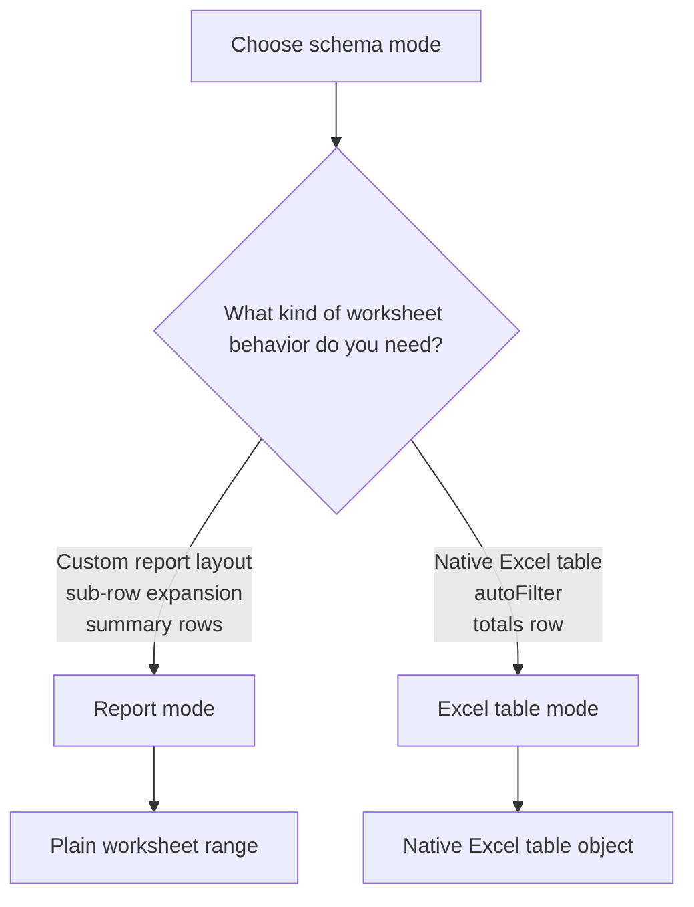
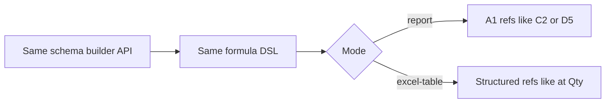

Every schema you create belongs to one of two modes. The mode is the most important decision you make when designing a schema — it controls output format, available features, and how formula columns reference cells.



## The two modes

```ts twoslash
import { createExcelSchema } from "@chronicstone/typed-xlsx";

// Report mode (default)
const reportSchema = createExcelSchema<{ name: string; amount: number }>();

// Excel table mode
const tableSchema = createExcelSchema<{ name: string; amount: number }>({ mode: "excel-table" });
```

### Report mode

Report mode produces a plain worksheet range. Rows are written directly into the sheet with no native Excel table object. Summary rows can appear below the data, structural groups and dynamic columns are supported, and multi-value columns can expand a single logical row into multiple physical rows.

This is the right choice when you need:

- Summary rows (totals, subtotals, tax lines)
- Sub-row expansion (e.g. one order → multiple line items)
- Full control over post-data layout

### Excel table mode

Excel table mode wraps the data in a native Excel `<table>` object. This enables native sorting and filtering dropdowns, a styled banded-row appearance, an optional totals row with built-in aggregate functions, and structured column references in formula columns.

This is the right choice when you need:

- Native Excel autoFilter / sort dropdowns out of the box
- A styled table (Light, Medium, or Dark presets)
- A totals row with one-click aggregates
- The table to behave like a proper Excel data table for pivot tables or Power Query

## Feature comparison

|                            | Report mode                    | Excel table mode                          |
| -------------------------- | ------------------------------ | ----------------------------------------- |
| Summary rows               | Yes                            | No (use totals row instead)               |
| Sub-row expansion          | Yes                            | No — throws at output time                |
| Groups and dynamic columns | Yes                            | Yes (flat only, no sub-row expansion)     |
| Native table object        | No                             | Yes                                       |
| AutoFilter default         | Off — opt in with `autoFilter` | On — opt out with `autoFilter: false`     |
| Totals row                 | No                             | Yes — per-column label or aggregate       |
| Formula cell refs          | A1-style (`C2`, `D5`)          | Structured (`[@Qty]`, `[@UnitPrice]`)     |
| Table style                | Per-cell `CellStyle` only      | Native Excel style + per-cell `CellStyle` |
| Streaming support          | Yes                            | Yes                                       |

## Decision guide

**Use excel-table mode when:**

- You want native Excel filtering and sorting with no extra configuration
- You want a built-in totals row (sum, average, count, etc.)
- You want the table to have an Excel-native visual style
- Your consumers will use the data in pivot tables or Power Query

**Use report mode when:**

- You need summary rows (custom totals, VAT lines, running totals)
- You need sub-row expansion (one logical row → many physical rows)
- You need fully custom post-data layout

## What the mode controls at schema build time

When you call `.build()`, the schema is frozen as either a `ReportSchemaDefinition` or an `ExcelTableSchemaDefinition`. These are distinct types — the workbook builder uses them to determine which output path to take.

Formula columns in report mode emit A1-style cell references. Formula columns in excel-table mode emit structured references. The formula DSL — `row.ref()`, `refs.group()`, `refs.dynamic()`, `fx.round()`, arithmetic operators — is identical in both modes; only the emitted string differs.



```ts twoslash
import { createExcelSchema } from "@chronicstone/typed-xlsx";

// Same formula DSL, different emitted strings
const reportSchema = createExcelSchema<{ qty: number; price: number }>()
  .column("qty", { accessor: "qty", header: "Qty" })
  .column("price", { accessor: "price", header: "Price" })
  .column("total", {
    header: "Total",
    formula: ({ row }) => row.ref("qty").mul(row.ref("price")),
    // Emits: =A2*B2 for this exact column order (A1 style)
  })
  .build();

const tableSchema = createExcelSchema<{ qty: number; price: number }>({ mode: "excel-table" })
  .column("qty", { accessor: "qty", header: "Qty" })
  .column("price", { accessor: "price", header: "Price" })
  .column("total", {
    header: "Total",
    formula: ({ row }) => row.ref("qty").mul(row.ref("price")),
    // Emits: =[@[Qty]]*[@[Price]] (structured reference)
  })
  .build();
```

Both schemas use the same `.column()` API, the same formula DSL, and the same `select`, `context`, group, and dynamic-column APIs. The mode changes the output contract, not the authoring experience.

One helpful way to think about the library is that you make two independent decisions:

1. Choose the schema mode: report or excel-table
2. Choose the workbook builder: buffered or streaming
