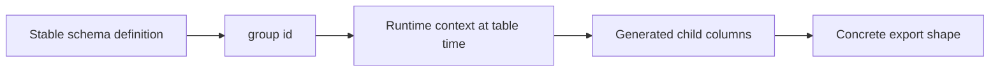
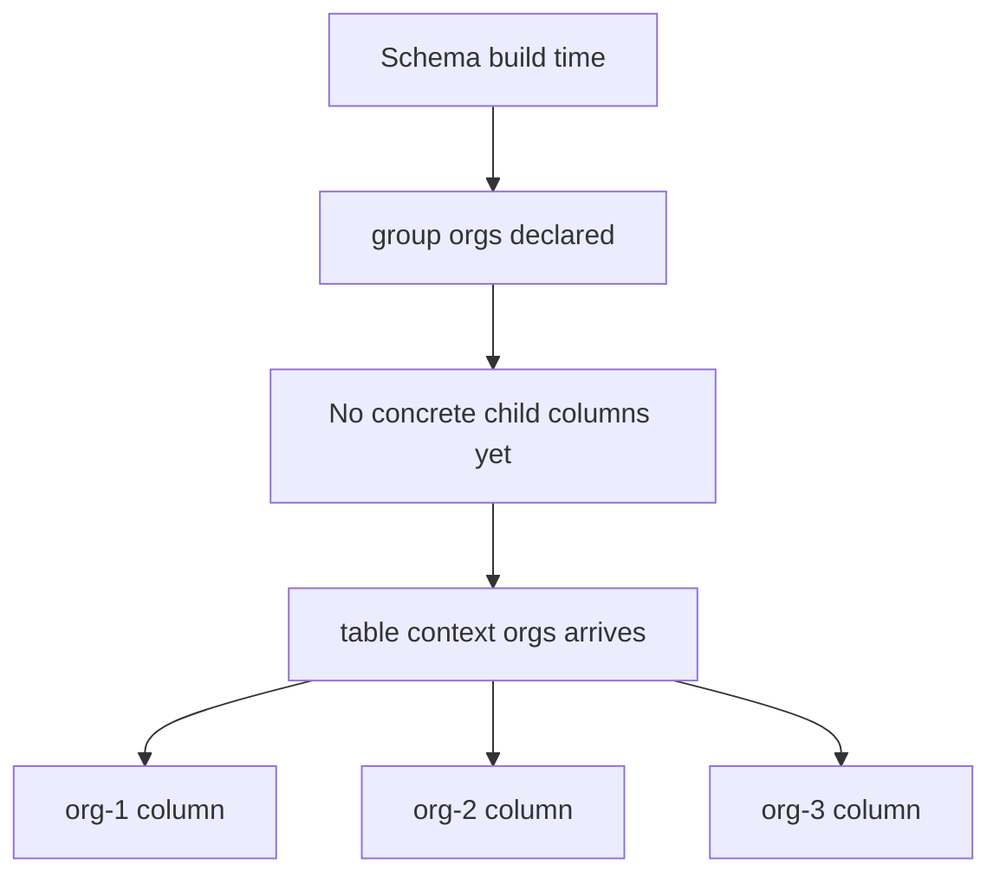
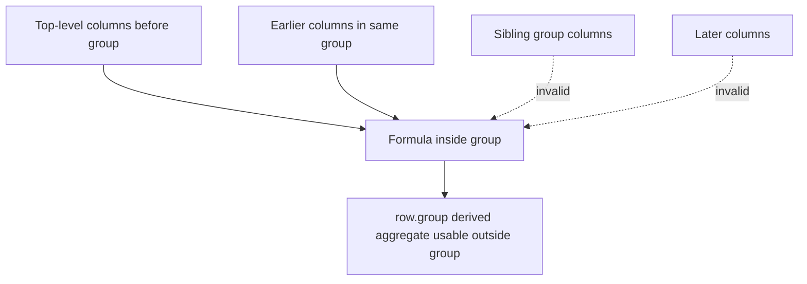

Groups let you generate columns programmatically from runtime data. The most common use case is one column per dynamic dimension — one column per organization, one column per month, one column per category.



Groups work in both schema modes:

- `createExcelSchema<T>()` / `mode: "report"`
- `createExcelSchema<T>({ mode: "excel-table" })`

The Excel-table variant still has one important constraint: generated columns must stay physically flat, just like any other native Excel table column.

## Defining a group

`.group(id, buildFn)` accepts a builder callback that receives the schema builder and, optionally, a typed context value as its second parameter.

```ts twoslash
import { createExcelSchema, createWorkbook } from "@chronicstone/typed-xlsx";

type User = {
  firstName: string;
  organizations: Array<{ id: number; name: string }>;
};

const schema = createExcelSchema<User>()
  .column("firstName", { accessor: "firstName", header: "Name" })
  .group("orgs", (builder, orgs: Array<{ id: number; name: string }>) => {
    for (const org of orgs) {
      builder.column(`org-${org.id}`, {
        header: org.name,
        accessor: (row) => (row.organizations.some((o) => o.id === org.id) ? "Yes" : "No"),
      });
    }
  })
  .build();
```

## Injecting context at table time

Groups receive their context when the table is built, not when the schema is defined. Pass context via the `context` option on `.table()`, keyed by group id.

```ts twoslash
import { createExcelSchema, createWorkbook } from "@chronicstone/typed-xlsx";

type User = {
  firstName: string;
  organizations: Array<{ id: number; name: string }>;
};

const schema = createExcelSchema<User>()
  .column("firstName", { accessor: "firstName", header: "Name" })
  .group("orgs", (builder, orgs: Array<{ id: number; name: string }>) => {
    for (const org of orgs) {
      builder.column(`org-${org.id}`, {
        header: org.name,
        accessor: (row) => (row.organizations.some((o) => o.id === org.id) ? "✓" : ""),
        style: (row) => ({
          fill: {
            color: {
              rgb: row.organizations.some((o) => o.id === org.id) ? "DCFCE7" : "FEF2F2",
            },
          },
          alignment: { horizontal: "center" },
        }),
      });
    }
  })
  .build();

const orgs = [
  { id: 1, name: "Acme Corp" },
  { id: 2, name: "Globex" },
  { id: 3, name: "Initech" },
];

const users: User[] = [];

createWorkbook().sheet("Users").table("users", {
  rows: users,
  schema,
  context: { orgs },
});
```

The schema definition carries no reference to `orgs`. The columns are generated fresh from whatever context is passed at table-build time.



## Context shape is statically verified

The `context` object is fully typed. Hover over `RequiredContext` to see the exact shape the schema expects:

```ts twoslash
import { createExcelSchema } from "@chronicstone/typed-xlsx";
import type { SchemaGroupContext } from "@chronicstone/typed-xlsx";

type User = { name: string; orgs: Array<{ id: number; name: string }> };

const schema = createExcelSchema<User>()
  .column("name", { accessor: "name" })
  .group("orgs", (b, items: Array<{ id: number; name: string }>) => {
    for (const item of items) {
      b.column(`org-${item.id}`, {
        header: item.name,
        accessor: (r) => (r.orgs.some((o) => o.id === item.id) ? "Yes" : "No"),
      });
    }
  })
  .build();

type RequiredContext = SchemaGroupContext<typeof schema>;
//   ^?
```

The type is derived automatically from the second parameter of the group callback. Annotate that parameter and the context object shape is inferred without any extra helper type.

## Missing context is a compile error when the group is selected

When a selected group declares a context parameter, `context` becomes a **required** property on `.table()`. Omitting it is caught at compile time, not at runtime:

```ts twoslash
// @errors: 2345
import { createExcelSchema, createWorkbook } from "@chronicstone/typed-xlsx";

type User = { name: string; orgs: number[] };

const schema = createExcelSchema<User>()
  .column("name", { accessor: "name" })
  .group("orgIds", (b, ids: number[]) => {
    for (const id of ids) b.column(`org-${id}`, { accessor: (r) => r.orgs.includes(id) });
  })
  .build();

// Error: 'context' is required because the selected group needs it
createWorkbook()
  .sheet("Report")
  .table("report", {
    rows: [],
    schema,
    select: { include: ["orgIds"] },
  });
```

Conversely, groups without a context parameter do not require `context`, and contextful groups can be excluded via `select` so `context` becomes optional again.

## Wrong context type is caught

Supplying a context value of the wrong type is also a compile error:

```ts twoslash
// @errors: 2322
import { createExcelSchema, createWorkbook } from "@chronicstone/typed-xlsx";

type User = { name: string; orgs: number[] };

const schema = createExcelSchema<User>()
  .column("name", { accessor: "name" })
  .group("orgIds", (b, ids: number[]) => {
    for (const id of ids) b.column(`org-${id}`, { accessor: (r) => r.orgs.includes(id) });
  })
  .build();

createWorkbook()
  .sheet("Report")
  .table("report", {
    rows: [],
    schema,
    context: {
      orgIds: "should-be-a-number-array", // Error: string is not assignable to number[]
    },
  });
```

## Use with column selection

Selection works at the group level. That means `select.include` and `select.exclude` accept the group id itself, not the ids of the generated child columns. This keeps the public API stable even when the group generates different columns depending on runtime context.

```ts twoslash
import { createExcelSchema, createWorkbook } from "@chronicstone/typed-xlsx";

type Row = { name: string; orgs: number[] };

const schema = createExcelSchema<Row>()
  .column("name", { accessor: "name" })
  .group("memberships", (b, orgIds: number[]) => {
    for (const id of orgIds) {
      b.column(`org-${id}`, { accessor: (r) => r.orgs.includes(id) });
    }
  })
  .build();

createWorkbook()
  .sheet("Sheet")
  .table("sheet", {
    rows: [],
    schema,
    select: { exclude: ["memberships"] },
  });
```

Because the only contextful group is excluded here, `context` is not needed at all.

Only groups that declare a context parameter contribute to `SchemaGroupContext`, and only selected contextful groups make `context` required.

## Formula columns inside groups

Formula columns work inside `.group()` callbacks — they follow the same predecessor-based scope rules as top-level formulas. A formula inside a group can reference:

- Any column declared before the group in the top-level chain (outer scope)
- Any column declared before it within the same group (local scope)



```ts twoslash
import { createExcelSchema } from "@chronicstone/typed-xlsx";

type Row = { baseRate: number; units: number };

const schema = createExcelSchema<Row>()
  .column("baseRate", { accessor: "baseRate" })
  .column("units", { accessor: "units" })
  .group("derived", (g) => {
    const withGrossRevenue = g.column("grossRevenue", {
      header: "Gross",
      // References outer columns
      formula: ({ row, fx }) => fx.round(row.ref("units").mul(row.ref("baseRate")), 2),
      style: { numFmt: "$#,##0.00" },
    });
    withGrossRevenue.column("commission", {
      header: "Commission",
      // References previous local group column + outer column
      formula: ({ row, fx }) => fx.round(row.ref("grossRevenue").mul(0.1), 2),
      style: { numFmt: "$#,##0.00" },
    });
  })
  .column("groupTotal", {
    header: "Group Total",
    // References the group as a whole — sums all columns in 'derived'
    formula: ({ row }) => row.group("derived").sum(),
    style: { numFmt: "$#,##0.00", font: { bold: true } },
  })
  .build();
```

Group aggregations available via `row.group(id)`: `.sum()`, `.average()`, `.min()`, `.max()`, `.count()`.

For the full scope rule reference and how group scope interacts with mode output (A1 vs structured references), see [Scope and Modes](/formulas/scope-and-modes).
