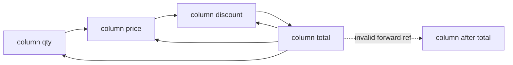
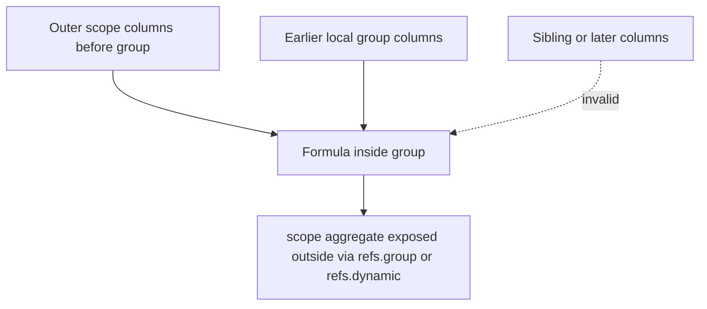
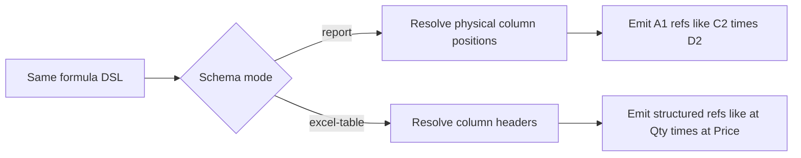

Understanding how formula scope works — and how the output changes between report and excel-table mode — is essential for building correct, maintainable formulas.

## Logical rows and physical rows

Report mode can expand one logical row into multiple physical worksheet rows. That row model is explained in depth in [Row Model](/formulas/row-model), including when to use `refs.column(...)`, `row.series(...)`, `column.cells()`, and `column.rows()`.

## Predecessor-based scope

Formula columns can only reference columns declared **before them** in the same schema. This rule is enforced by TypeScript at declaration time through the schema builder's accumulated type state.

The builder tracks which column IDs have been declared so far. When you write `refs.column("someId")` or `refs.column("someId")`, TypeScript checks the accumulated ID union. If `"someId"` hasn't been declared yet, it's a type error.



```ts twoslash
// @errors: 2345
import { createExcelSchema } from "@chronicstone/typed-xlsx";

createExcelSchema<{ qty: number; price: number; discount: number }>()
  .column("qty", { accessor: "qty" })
  // 'total' references 'discount' which hasn't been declared yet — type error
  .column("total", {
    formula: ({ row, refs }) => refs.column("qty").mul(refs.column("discount")),
  })
  .column("price", { accessor: "price" })
  .column("discount", { accessor: "discount" })
  .build();
```

### Chaining formula columns

Formula columns can reference other formula columns, as long as they appear earlier:

```ts twoslash
import { createExcelSchema } from "@chronicstone/typed-xlsx";

const schema = createExcelSchema<{
  contractValue: number;
  discountPct: number;
  taxRate: number;
}>()
  .column("contractValue", { accessor: "contractValue" })
  .column("discountPct", { accessor: "discountPct" })
  .column("taxRate", { accessor: "taxRate" })
  .column("netValue", {
    // References two data columns
    formula: ({ row, refs, fx }) =>
      fx.round(refs.column("contractValue").mul(fx.literal(1).sub(refs.column("discountPct"))), 2),
  })
  .column("taxOwed", {
    // References a formula column ('netValue') declared above
    formula: ({ row, refs, fx }) =>
      fx.round(refs.column("netValue").mul(refs.column("taxRate")), 2),
  })
  .column("total", {
    // References two formula columns
    formula: ({ row, refs }) => refs.column("netValue").add(refs.column("taxOwed")),
  })
  .build();
```

## Group and dynamic scope

Columns declared inside a `.group()` or `.dynamic()` follow the same predecessor rule, but with two scopes:

1. **Outer scope** — columns declared before the group in the top-level chain
2. **Local scope** — columns declared before the current column within the same group

A formula column inside one of those scopes can reference columns from both scopes. To reference a previously declared local scope column, keep using the builder returned by the prior `.column(...)` call so the local scope widens correctly:



```ts twoslash
import { createExcelSchema } from "@chronicstone/typed-xlsx";

type Row = {
  baseRate: number;
  amer: number;
  apac: number;
  emea: number;
};

const schema = createExcelSchema<Row>()
  .column("baseRate", { accessor: "baseRate" }) // outer scope
  .group("regions", (g) => {
    const withAmer = g.column("amer", { header: "AMER", accessor: "amer" });
    const withApac = withAmer.column("apac", { header: "APAC", accessor: "apac" });
    const withEmea = withApac.column("emea", { header: "EMEA", accessor: "emea" });
    withEmea.column("total", {
      header: "Total",
      // Can reference outer 'baseRate' AND local group predecessors 'amer', 'apac', 'emea'
      formula: ({ row, refs }) =>
        refs
          .column("amer")
          .add(refs.column("apac"))
          .add(refs.column("emea"))
          .mul(refs.column("baseRate")),
    });
  })
  .column("globalAvg", {
    header: "Global Avg",
    // Can reference the group aggregate (NOT individual columns inside the group)
    formula: ({ refs, fx }) => fx.average(refs.group("regions")),
  })
  .build();
```

Dynamic scopes behave the same way, except the aggregated scope is referenced through `refs.dynamic("id")`.

### What you cannot do

- Reference a column from inside a group, from outside the group by its ID
- Reference a column from a sibling group
- Reference a column declared after the current position (forward reference)
- Self-reference

These are all type errors or runtime errors.

## A1 vs structured references

The formula DSL is identical in both modes. What changes is the string the library emits into the XLSX cell:

### Report mode — A1 style

Each formula column emits an absolute row-specific A1 reference for each physical row it occupies. The column letter is resolved from the column's physical position in the worksheet.

If the logical row expands, repeated formulas use the current physical row reference, while row-series formulas can target the whole logical-row span.

For `refs.column("qty").mul(refs.column("price"))`, the exact A1 refs depend on the physical worksheet layout. If `qty` is in column C and `price` is in column D:

- Row 2 (first data row): `=C2*D2`
- Row 3: `=C3*D3`
- Row 100: `=C100*D100`

For a row-series aggregate on an expanded logical row, output can instead look like `=AVERAGE(C2:C4)`.

### Excel table mode — structured references

Each formula column emits a single structured reference that Excel repeats down the entire table. The column name is resolved from the column's `header` (or ID if no header is set).

For `refs.column("qty").mul(refs.column("price"))` with headers `"Qty"` and `"Price"`:

- Every row: `=[@[Qty]]*[@[Price]]`

Structured references are independent of physical position — they don't break if rows are inserted, the table is moved, or the sheet is renamed.



### Side-by-side comparison

```ts twoslash
import { createExcelSchema } from "@chronicstone/typed-xlsx";

// Report mode — emits A1 refs based on physical column position
const reportSchema = createExcelSchema<{ qty: number; price: number }>()
  .column("qty", { header: "Qty", accessor: "qty" })
  .column("price", { header: "Price", accessor: "price" })
  .column("total", {
    header: "Total",
    formula: ({ row, refs }) => refs.column("qty").mul(refs.column("price")),
  })
  .build();

// Excel table mode — emits =[@[Qty]]*[@[Price]] for every row
const tableSchema = createExcelSchema<{ qty: number; price: number }>({ mode: "excel-table" })
  .column("qty", { header: "Qty", accessor: "qty" })
  .column("price", { header: "Price", accessor: "price" })
  .column("total", {
    header: "Total",
    formula: ({ row, refs }) => refs.column("qty").mul(refs.column("price")),
  })
  .build();
```

Same DSL call — the mode controls the output.

## Header label collision handling

In excel-table mode, structured references use the column header. If two columns share the same header, the library appends a numeric suffix to make names unique: `Amount`, `Amount2`, `Amount3`, etc.

To avoid this, ensure formula column headers are unique within the schema.

## Runtime validation

TypeScript catches most scope violations at declaration time, but some errors can only be detected at output time:

| Situation                                                                  | Behavior              |
| -------------------------------------------------------------------------- | --------------------- |
| Referenced column not declared yet                                         | TypeScript error      |
| Referenced column excluded via `select.exclude`                            | Throws at output time |
| Referenced column inside a group or dynamic scope, referenced from outside | TypeScript error      |
| Group ID referenced before the group is declared                           | TypeScript error      |
| Dynamic ID referenced before the dynamic scope is declared                 | TypeScript error      |
| Formula column in excel-table mode with sub-row accessor                   | Throws at output time |

Runtime errors are descriptive — they name the problematic column ID and the table where the conflict occurred.

## Practical rule of thumb

Use this checklist when working with expanded rows:

- use `refs.column(...)` for per-physical-row formulas
- use `row.series(...)` for per-logical-row formulas over expanded cells
- use `expansion: "single"` when a logical-row result should render once and merge vertically
- use `expansion: "expand"` when the same logical-row result should repeat on every physical row
- use `column.cells()` in summaries when you want physical-row math
- use `column.rows()` in summaries when you want logical-row math
