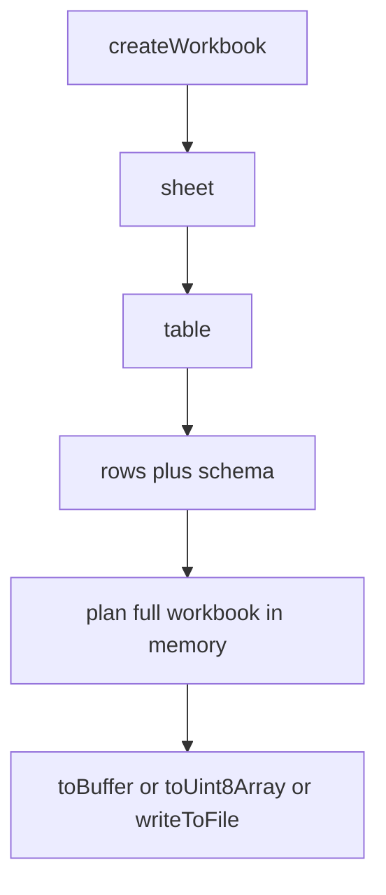
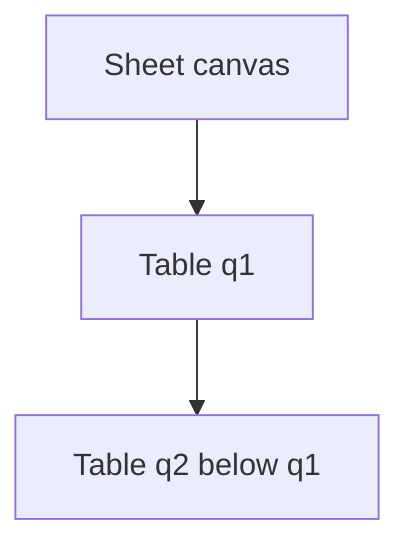
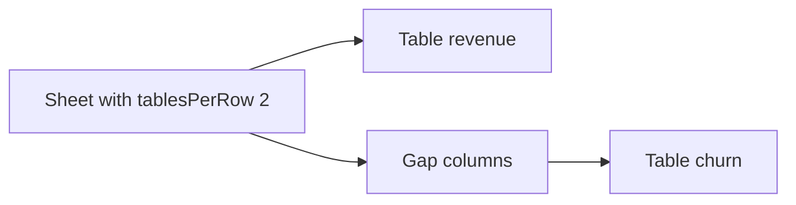
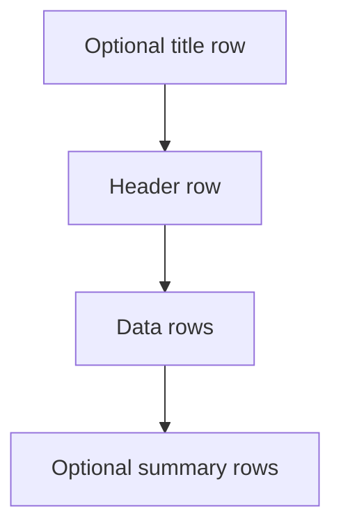
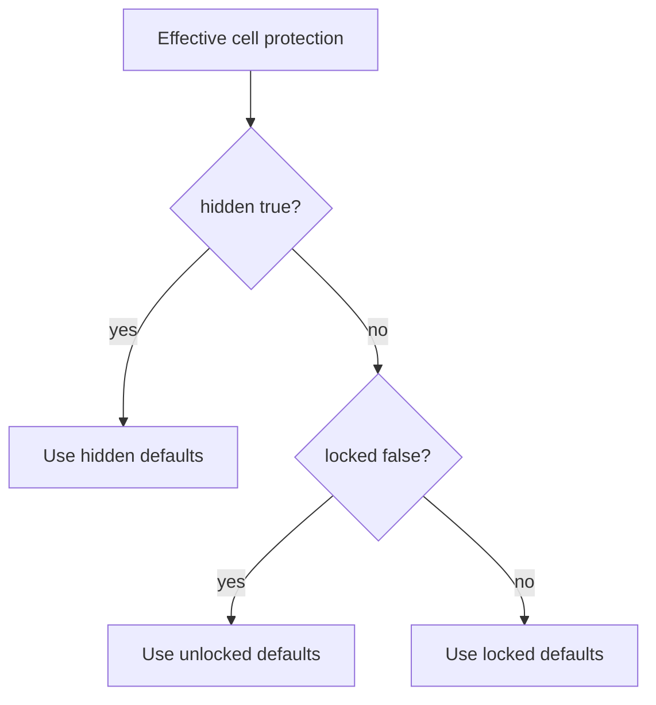

`createWorkbook()` builds the entire XLSX in memory and returns bytes synchronously. Use it when your dataset fits in memory and you want the simplest possible API.



## Basic structure

```ts twoslash
import { createExcelSchema, createWorkbook } from "@chronicstone/typed-xlsx";

const userSchema = createExcelSchema<{ name: string; email: string; role: string }>()
  .column("name", { header: "Name", accessor: "name" })
  .column("email", { header: "Email", accessor: "email" })
  .column("role", { header: "Role", accessor: "role" })
  .build();

const workbook = createWorkbook();

workbook.sheet("Users").table("users", {
  schema: userSchema,
  rows: [
    { name: "Alice Martin", email: "alice@acme.com", role: "Admin" },
    { name: "Bob Chen", email: "bob@acme.com", role: "Viewer" },
  ],
});

const buffer = workbook.toBuffer();
// or: const bytes = workbook.toUint8Array();
// or: await workbook.writeToFile("./users.xlsx");
```

## Multiple sheets

Call `.sheet()` once per sheet. Each sheet is independent — it can have its own schema, row type, layout, and tables:

```ts twoslash
import { createExcelSchema, createWorkbook } from "@chronicstone/typed-xlsx";

const orderSchema = createExcelSchema<{ orderId: string; total: number }>()
  .column("orderId", { header: "Order ID", accessor: "orderId" })
  .column("total", { header: "Total", accessor: "total", style: { numFmt: "$#,##0.00" } })
  .build();

const productSchema = createExcelSchema<{ sku: string; stock: number; price: number }>()
  .column("sku", { header: "SKU", accessor: "sku" })
  .column("stock", { header: "In Stock", accessor: "stock" })
  .column("price", { header: "Price", accessor: "price", style: { numFmt: "$#,##0.00" } })
  .build();

const workbook = createWorkbook();

workbook.sheet("Orders").table("orders", {
  schema: orderSchema,
  rows: [{ orderId: "ORD-001", total: 4200 }],
});

workbook.sheet("Inventory").table("products", {
  schema: productSchema,
  rows: [{ sku: "SKU-A", stock: 42, price: 29.99 }],
});

await workbook.writeToFile("./report.xlsx");
```

## Multiple tables on one sheet

Call `.table()` multiple times on the same sheet. By default tables are stacked vertically:



```ts twoslash
import { createExcelSchema, createWorkbook } from "@chronicstone/typed-xlsx";

const summarySchema = createExcelSchema<{ region: string; revenue: number }>()
  .column("region", { accessor: "region" })
  .column("revenue", { accessor: "revenue", style: { numFmt: "$#,##0.00" } })
  .build();

const workbook = createWorkbook();
const sheet = workbook.sheet("Dashboard");

sheet.table("q1", {
  schema: summarySchema,
  rows: [{ region: "AMER", revenue: 120000 }],
});

sheet.table("q2", {
  schema: summarySchema,
  rows: [{ region: "AMER", revenue: 145000 }],
});
```

## Side-by-side layout

Pass `tablesPerRow` in sheet options to place tables side by side. `tableColumnGap` and `tableRowGap` control spacing (in columns/rows):



```ts twoslash
import { createExcelSchema, createWorkbook } from "@chronicstone/typed-xlsx";

const kpiSchema = createExcelSchema<{ metric: string; value: number }>()
  .column("metric", { accessor: "metric" })
  .column("value", { accessor: "value" })
  .build();

const workbook = createWorkbook();
workbook
  .sheet("KPIs", {
    tablesPerRow: 2,
    tableColumnGap: 2,
    tableRowGap: 1,
  })
  .table("revenue", {
    schema: kpiSchema,
    rows: [{ metric: "MRR", value: 48000 }],
  })
  .table("churn", {
    schema: kpiSchema,
    rows: [{ metric: "Churn Rate", value: 0.023 }],
  });
```

## Freeze panes

Freeze the header row (and optionally columns) so it stays visible when scrolling:

```ts twoslash
import { createExcelSchema, createWorkbook } from "@chronicstone/typed-xlsx";

const schema = createExcelSchema<{ id: string; name: string; amount: number }>()
  .column("id", { accessor: "id" })
  .column("name", { accessor: "name" })
  .column("amount", { accessor: "amount" })
  .build();

const workbook = createWorkbook();
workbook
  .sheet("Report", {
    freezePane: { rows: 1 }, // Freeze the header row
  })
  .table("data", {
    schema,
    rows: [{ id: "1", name: "Acme", amount: 5000 }],
  });
```

## Table title

Report tables support an optional `title` that renders as a row above the column headers:



```ts twoslash
import { createExcelSchema, createWorkbook } from "@chronicstone/typed-xlsx";

const schema = createExcelSchema<{ account: string; mrr: number }>()
  .column("account", { accessor: "account" })
  .column("mrr", { accessor: "mrr", style: { numFmt: "$#,##0.00" } })
  .build();

const workbook = createWorkbook();
workbook.sheet("Accounts").table("accounts", {
  schema,
  rows: [{ account: "Acme Corp", mrr: 4200 }],
  title: "Monthly Recurring Revenue — Q1 2025",
});
```

## Column selection

`select` filters which schema columns appear in the output without modifying the schema. Use `include` for an allow-list or `exclude` for a deny-list. Both are typed to the column IDs declared in the schema:

```ts twoslash
import { createExcelSchema, createWorkbook } from "@chronicstone/typed-xlsx";

const schema = createExcelSchema<{
  id: string;
  name: string;
  email: string;
  salary: number;
  department: string;
}>()
  .column("id", { accessor: "id" })
  .column("name", { accessor: "name" })
  .column("email", { accessor: "email" })
  .column("salary", { accessor: "salary" })
  .column("department", { accessor: "department" })
  .build();

const workbook = createWorkbook();

// Public export — omit salary
workbook.sheet("Directory").table("staff", {
  schema,
  rows: [{ id: "1", name: "Alice", email: "alice@co.com", salary: 95000, department: "Eng" }],
  select: { exclude: ["salary"] },
});
```

## Table style defaults

Use `defaults` on `.table()` to define table-wide styling defaults for headers, summaries, and cell states.

This is useful when you want one visual language for editable cells, locked cells, and hidden formula cells without repeating styles on every column.

```ts twoslash
import { createExcelSchema, createWorkbook } from "@chronicstone/typed-xlsx";

const renewalSchema = createExcelSchema<{
  account: string;
  currentArr: number;
  targetArr: number;
  uplift: number;
}>()
  .column("account", { accessor: "account" })
  .column("currentArr", {
    accessor: "currentArr",
    style: { numFmt: '"$"#,##0', alignment: { horizontal: "right" } },
  })
  .column("targetArr", {
    accessor: "targetArr",
    style: {
      numFmt: '"$"#,##0',
      alignment: { horizontal: "right" },
      protection: { locked: false },
    },
  })
  .column("uplift", {
    formula: ({ row, fx }) =>
      fx.if(row.ref("currentArr").gt(0), row.ref("targetArr").div(row.ref("currentArr")).sub(1), 0),
    style: {
      numFmt: "0.0%",
      alignment: { horizontal: "right" },
      protection: { hidden: true },
    },
  })
  .build();

const workbook = createWorkbook();

workbook.sheet("Renewals").table("renewals", {
  schema: renewalSchema,
  rows: [{ account: "Acme", currentArr: 100000, targetArr: 112000, uplift: 0.12 }],
  defaults: {
    header: { preset: "header.accent" },
    summary: { preset: "summary.subtle" },
    cells: {
      unlocked: { preset: "cell.input" },
      locked: { preset: "cell.locked" },
      hidden: { preset: "cell.hidden" },
    },
  },
});
```

Supported presets:

- `header.accent`
- `header.inverse`
- `summary.subtle`
- `cell.input`
- `cell.locked`
- `cell.hidden`

Merge order:

- library defaults
- table `defaults`
- column `style` / `headerStyle`
- hyperlink-local style overrides

Cell-state defaults are resolved from the effective cell protection style:

- `hidden` when `protection.hidden === true`
- `unlocked` when `protection.locked === false`
- `locked` otherwise



## Excel table input options

When using an excel-table schema, additional options are available:

| Option       | Type              | Default               | Description                       |
| ------------ | ----------------- | --------------------- | --------------------------------- |
| `name`       | `string`          | Table ID              | Excel table name (must be unique) |
| `style`      | `ExcelTableStyle` | `"TableStyleMedium2"` | Visual style preset               |
| `autoFilter` | `boolean`         | `true`                | Show filter dropdowns in header   |
| `totalsRow`  | `boolean`         | `false`               | Enable the native totals row      |

## Output methods

| Method                       | Returns         | Notes                       |
| ---------------------------- | --------------- | --------------------------- |
| `workbook.toBuffer()`        | `Buffer`        | Node.js Buffer              |
| `workbook.toUint8Array()`    | `Uint8Array`    | Works in any JS environment |
| `workbook.writeToFile(path)` | `Promise<void>` | Writes directly to disk     |
