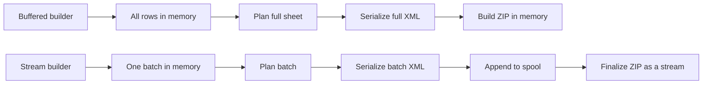
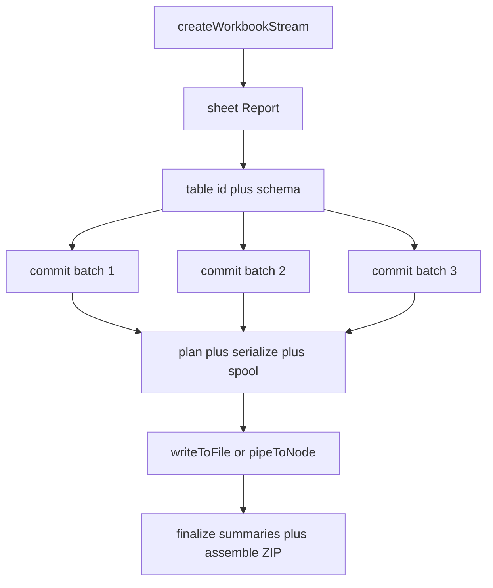

`createWorkbookStream()` builds an XLSX file incrementally from row batches without ever holding the full dataset in memory.

## Why streaming exists

The buffered builder (`createWorkbook()`) accumulates every row in memory before writing any XML. For small and medium reports this is fine. For large exports — hundreds of thousands of rows, wide schemas, multi-sheet reports — heap usage scales linearly with dataset size, and there is no way around it.

The stream builder separates **ingestion** from **serialization**. As you commit row batches, each batch is planned and serialized into an OOXML fragment that gets appended to a temporary spool (file-backed by default). When you call a finalization method, the engine streams the spooled sheet data into a ZIP archive incrementally — the compressor never loads the full workbook into memory at once.

## When to use each builder

|                    | Buffered                | Stream                                  |
| ------------------ | ----------------------- | --------------------------------------- |
| Dataset size       | Up to ~50k rows         | Unbounded                               |
| API style          | Synchronous composition | Async commit-based                      |
| Memory model       | Full dataset in heap    | Mostly bounded by batch size and config |
| Summary support    | Yes                     | Yes                                     |
| Excel table mode   | Yes                     | Yes                                     |
| Formula columns    | Yes                     | Yes                                     |
| Multi-table sheets | Yes                     | Yes                                     |
| Freeze panes, RTL  | Yes                     | Yes                                     |
| Output targets     | Buffer, file            | File, Node stream, Web stream, Readable |
| Complexity         | Low                     | Moderate                                |

If your dataset fits comfortably in memory, use the buffered builder. The commit-based API adds async complexity; only reach for it when you actually need much flatter memory behavior.

For the exact memory trade-offs of `tempStorage` and string strategy, see [Memory Tuning](/streaming/memory-tuning).

## How the engine works

Each commit call:

1. Runs the row planner (sub-row expansion, merges, widths)
2. Serializes the batch as OOXML `<row>` elements
3. Appends the fragment to the sheet spool
4. Advances each column's summary accumulator via `step()`

At finalization:

1. Calls `finalize()` on each summary accumulator
2. Appends summary rows to the spool
3. Streams the ZIP: `[Content_Types].xml`, `workbook.xml`, `styles.xml`, each sheet spool, `sharedStrings.xml`

## Full feature parity

The stream builder is not a degraded mode. It supports the same feature set as the buffered builder:

- **Excel table mode** — pass an `ExcelTableSchemaDefinition` and all native table features (autoFilter, style, totals row, structured formula refs) work identically to buffered mode
- **Formula columns** — both A1-style (report mode) and structured references (excel-table mode) are resolved correctly at finalization time
- Column summaries (reducer-based, accumulated per batch)
- Sub-row expansion from array-valued accessors
- Cell merges
- Freeze panes (`freezePane: { rows, columns }`)
- Right-to-left sheets (`rightToLeft: true`)
- Column selection (`include` / `exclude`)
- Per-cell and per-header `CellStyle`
- Multiple tables per sheet
