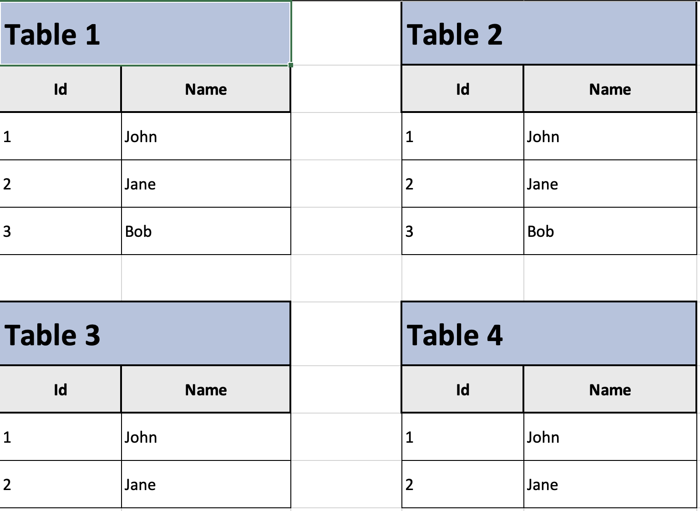

# Define Tables

In `typed-xlsx`, tables within a sheet are defined to organize and display data effectively. Each table can be customized with various properties to control its presentation and behavior. Here's a detailed look at each property and how to use them:

## Table Properties

### `schema`
- **Description:** The `ExcelSchemaBuilder` schema you want to use for the table.
- **Type:** `ExcelSchema`
- **Required:** Yes

```ts twoslash
import { ExcelBuilder, ExcelSchemaBuilder } from '@chronicstone/typed-xlsx'
// ---cut-before---
const userSchema = ExcelSchemaBuilder.create<{ firstName: string, lastName: string }>()
  .column('firstName', { key: 'firstName' })
  .column('lastName', { key: 'lastName' })
  .build()

const file = ExcelBuilder.create()
  .sheet('Users')
  .addTable({
    data: [] as Array<{ firstName: string, lastName: string }>,
    schema: userSchema,
  })
  .build({ output: 'buffer' })
```

### data
- **Description:** The data to be displayed in the table.
- **Type:** `T[]`
- **Required:** Yes

```ts twoslash
import { ExcelBuilder, ExcelSchemaBuilder } from '@chronicstone/typed-xlsx'
// ---cut-before---
const userSchema = ExcelSchemaBuilder.create<{ firstName: string, lastName: string }>()
  .column('firstName', { key: 'firstName' })
  .column('lastName', { key: 'lastName' })
  .build()

const file = ExcelBuilder.create()
  .sheet('Users')
  .addTable({
    data: [{ firstName: 'John', lastName: 'Doe' }],
    schema: userSchema,
  })
  .build({ output: 'buffer' })
```

### select
- **Description:** A map of column keys to boolean values that determines which columns to include in the table.
- **Type:** `{ [key in ColKeys]?: boolean }`
- **Required:** No

```ts twoslash
import { ExcelBuilder, ExcelSchemaBuilder } from '@chronicstone/typed-xlsx'
// ---cut-before---
const userSchema = ExcelSchemaBuilder.create<{ firstName: string, lastName: string }>()
  .column('firstName', { key: 'firstName' })
  .column('lastName', { key: 'lastName' })
  .build()

const file = ExcelBuilder.create()
  .sheet('Users')
  .addTable({
    data: [{ firstName: 'John', lastName: 'Doe' }],
    schema: userSchema,
    select: { firstName: true },
    // There are thruthy values, so only columns set to true will be returned (firstName and lastName) are included
  })
  .addTable({
    data: [{ firstName: 'John', lastName: 'Doe' }],
    schema: userSchema,
    select: { firstName: false },
    // All values are false, so ALL columns are included except firstName
  })
  .build({ output: 'buffer' })
```

### context
- **Description:** A map of column keys to values that can be used to dynamically generate the table.
- **Type:** `{ [Key in GroupColKey]: GroupColumnContext[Key] }`
- **Required:** Depends on the schema & selected columns

```ts twoslash
// @errors: 2741
import { ExcelBuilder, ExcelSchemaBuilder } from '@chronicstone/typed-xlsx'
// ---cut-before---

interface Organization { id: string, name: string }

const userSchema = ExcelSchemaBuilder.create<{ firstName: string, lastName: string, organizations: Organization[] }>()
  .column('firstName', { key: 'firstName' })
  .column('lastName', { key: 'lastName' })
  .group('group:org', (builder, context: Organization[]) => {
    for (const org of context) {
      builder
        .column(`orga-${org.id}`, {
          label: `User in ${org.name}`,
          key: 'organizations',
          transform: orgs => orgs.some(o => o.id === org.id) ? 'YES' : 'NO',
          cellStyle: data => ({
            font: {
              color: { rgb: data.organizations.some(o => o.id === org.id)
                ? '61eb34'
                : 'd10808' },
            },
          }),
        })
    }
  })
  .build()

const organizations: Organization[] = [{ id: '1', name: 'Org 1' }, { id: '2', name: 'Org 2' }, { id: '3', name: 'Org 3' }]

const file = ExcelBuilder.create()
  .sheet('Users')
  .addTable({
    data: [{ firstName: 'John', lastName: 'Doe', organizations: [{ id: '1', name: 'Org 1' }] }],
    schema: userSchema,
    context: { },
  })
  .build({ output: 'buffer' })
```

### summary
- **Description:** Enable or disable the summary of the table.
- **Type:** `boolean`
- **Required:** No

```ts twoslash
import { ExcelBuilder, ExcelSchemaBuilder } from '@chronicstone/typed-xlsx'
const schema = ExcelSchemaBuilder.create<{ firstName: string, lastName: string }>()
  .column('firstName', { key: 'firstName' })
  .column('lastName', { key: 'lastName' })
  .build()

const data: Array<{ firstName: string, lastName: string }> = []

// ---cut-before---
const file = ExcelBuilder.create()
  .sheet('Users')
  .addTable({ data, schema, summary: false, })
  // The summary is disabled, so the table will not have a summary
  .build({ output: 'buffer' })
```

## Multiple Tables per Sheets

In typed-xlsx, you can define multiple tables per sheet, arranged in various layouts. Below is an example of displaying four tables, arranged in a row of two:

```ts twoslash
import { ExcelBuilder, ExcelSchemaBuilder } from '@chronicstone/typed-xlsx'
const schema = ExcelSchemaBuilder.create<{ firstName: string, lastName: string }>()
  .column('firstName', { key: 'firstName' })
  .column('lastName', { key: 'lastName' })
  .build()

const data: Array<{ firstName: string, lastName: string }> = []

// ---cut-before---
const file = ExcelBuilder.create()
  .sheet('Users', { tablesPerRow: 2 })
  .addTable({ data, schema, title: 'Table 1', })
  .addTable({ data, schema, title: 'Table 2', })
  .addTable({ data, schema, title: 'Table 3', })
  .addTable({ data, schema, title: 'Table 4', })
  .build({ output: 'buffer' })
```

The schema above will output :


